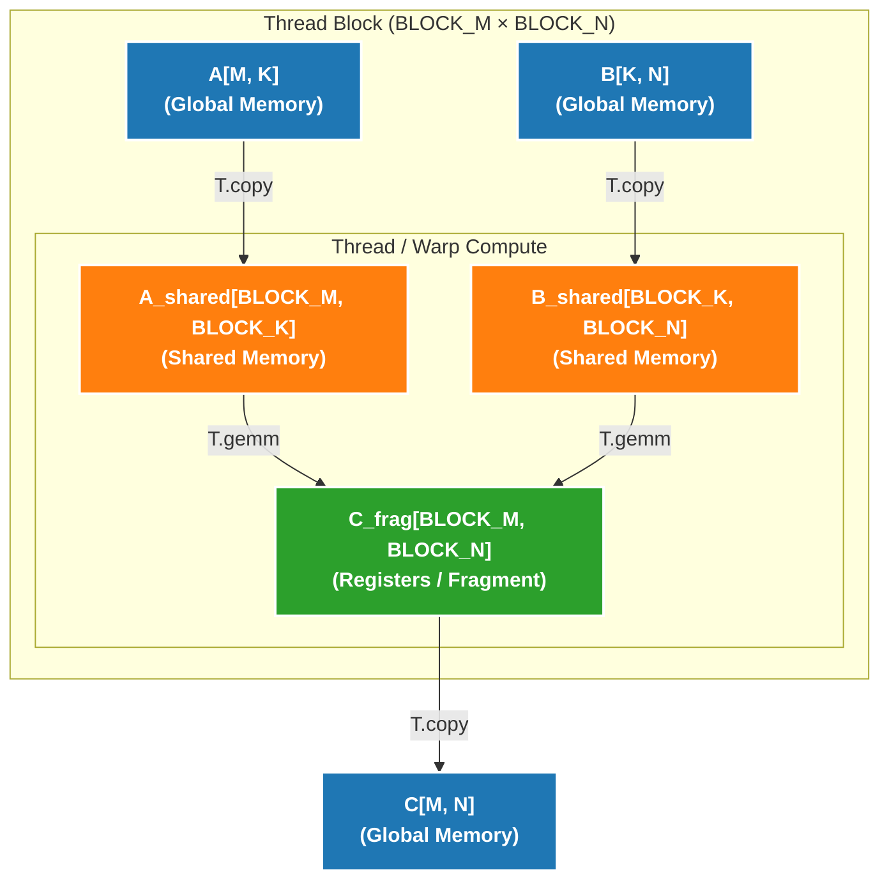

# Puzzle 08: Matrix Computation Code Analysis

## Overview

This puzzle is the most important chapter in the TileLang series, introducing the most fundamental computation in deep learning: **Matrix Operations**. We will start from matrix-vector multiplication (GEMV), gradually transition to matrix-matrix multiplication (GEMM), and learn how to leverage GPU Tensor Core for high-performance computing.

## Why Are Matrix Operations So Important?

In deep learning, almost all computations can be reduced to matrix operations:
- **Fully Connected Layer**: `Y = XW + b` (matrix multiplication)
- **Attention Mechanism**: `Attention = softmax(QK^T)V` (multiple matrix multiplications)
- **Convolution**: Can be converted to matrix multiplication (im2col)

Therefore, optimizing matrix operation performance directly determines the training and inference speed of deep learning models.

## Data Type Description

From this chapter, we use **float16** as input/output data type:

```python
dtype = T.float16        # Input/output
accum_dtype = T.float32  # Accumulator
```

**Why use float16?**
- **Modern AI Hardware Optimization**: GPU Tensor Core is optimized for float16
- **Memory Bandwidth**: float16 uses half the space of float32
- **Performance**: float16 computation speed is typically 2-8x faster than float32

**Why use float32 for accumulator?**
- **Numerical Stability**: Large amounts of float16 accumulation can easily overflow or lose precision
- **Mixed Precision**: Input float16, accumulate float32, output float16

> This chapter's examples assume `M % BLOCK_M == 0`, `N % BLOCK_N == 0`, `K % BLOCK_K == 0`, focusing on blocking, Tensor Core and pipelining itself first.
> Boundary handling will be explained separately in the implementation details section.

---

## Part 1: Matrix-Vector Multiplication (GEMV)

### Problem Definition

**Input**:
- `A: [M, K]` - Matrix (float16)
- `B: [K,]` - Vector (float16)

**Output**:
- `C: [M,]` - Vector (float16)

**Computation Definition**:
```python
for i in range(M):
    ACC = 0  # float32 accumulator
    for k in range(K):
        ACC += A[i, k] * B[k]
    C[i] = ACC  # Convert back to float16
```

### Intuitive Understanding

Assume `A` is a 3×4 matrix, `B` is a vector of length 4:

```
A = [[1, 2, 3, 4],      B = [1,
     [5, 6, 7, 8],           2,
     [9, 10, 11, 12]]        3,
                             4]

C[0] = 1*1 + 2*2 + 3*3 + 4*4 = 30
C[1] = 5*1 + 6*2 + 7*3 + 8*4 = 70
C[2] = 9*1 + 10*2 + 11*3 + 12*4 = 110
```

### Relationship with Reduce Sum

GEMV is essentially a **weighted Reduce Sum**:

```python
# Reduce Sum (Puzzle 05)
for i in range(N):
    C[i] = sum(A[i, :])

# GEMV (Puzzle 08)
for i in range(M):
    C[i] = sum(A[i, :] * B[:])  # Weighted sum
```

### PyTorch Reference Implementation

```python
def ref_gemv(A: torch.Tensor, B: torch.Tensor):
    assert A.shape == (M, K)
    assert B.shape == (K,)
    assert A.dtype == B.dtype == torch.float16
    return torch.matmul(input=A, other=B)  # Returns [M,]
```

### Implementation Framework

```python
@tilelang.jit
def tl_gemv(A, B, BLOCK_M: int, BLOCK_K: int):
    M, K = T.const("M, K")
    dtype = T.float16
    accum_dtype = T.float32
    A: T.Tensor((M, K), dtype)
    B: T.Tensor((K,), dtype)
    C = T.empty((M,), dtype)

    with T.Kernel(T.ceildiv(M, BLOCK_M), threads=128) as pid_m:
        # Allocate local storage
        A_local = T.alloc_fragment((BLOCK_M, BLOCK_K), dtype)
        B_local = T.alloc_fragment((BLOCK_K,), dtype)
        C_local = T.alloc_fragment((BLOCK_M,), accum_dtype)
        AB_temp = T.alloc_fragment((BLOCK_M, BLOCK_K), accum_dtype)

        # TODO: Complete the following steps
        # 1. Initialize accumulator T.clear(C_local)
        # 2. Serial traverse in K dimension, process BLOCK_K columns each time
        # 3. Load A_local, B_local
        # 4. Compute AB_temp[i, j] = A_local[i, j] * B_local[j] (need type conversion)
        # 5. Use T.reduce_sum(AB_temp, C_local, dim=1, clear=False) to reduce
        # 6. Write back result T.copy(C_local, C[...])

    return C
```

---

## Part 2: Matrix-Matrix Multiplication (GEMM) - Naive Version

### Problem Definition

**Input**:
- `A: [M, K]` - Matrix (float16)
- `B: [K, N]` - Matrix (float16)

**Output**:
- `C: [M, N]` - Matrix (float16)

**Computation Definition**:
```python
for i in range(M):
    for j in range(N):
        ACC = 0  # float32 accumulator
        for k in range(K):
            ACC += A[i, k] * B[k, j]
        C[i, j] = ACC
```

### Intuitive Understanding

```
A = [[1, 2],      B = [[1, 2, 3],
     [3, 4],           [4, 5, 6]]
     [5, 6]]

C[0,0] = 1*1 + 2*4 = 9
C[0,1] = 1*2 + 2*5 = 12
C[0,2] = 1*3 + 2*6 = 15
C[1,0] = 3*1 + 4*4 = 19
...
```

### From GEMV to GEMM

GEMM can be seen as a combination of multiple GEMVs:

```python
# GEMV: A[M, K] × B[K,] → C[M,]
C = matmul(A, B)

# GEMM: A[M, K] × B[K, N] → C[M, N]
# Equivalent to doing GEMV for each column of B
for j in range(N):
    C[:, j] = matmul(A, B[:, j])
```

### Tensor Core Introduction

Modern GPUs (like NVIDIA Ampere/Hopper) contain dedicated matrix computation units:

- **CUDA Core**: Scalar/vector operations, flexible but slower
- **Tensor Core**: Matrix operations, specialized but extremely fast

**Tensor Core Operation Example**:
```
One MMA instruction: 16×16×16 FP16 matrix multiplication
Input: A[16, 16], B[16, 16]
Output: C[16, 16] (accumulated to existing value)
```

**TileLang's T.gemm**:
```python
T.gemm(A_frag, B_frag, C_frag, transpose_A=False, transpose_B=False)
```

- Automatically calls Tensor Core's MMA instructions
- Handles complex memory layouts and data loading
- Supports matrix transposition

For teaching purposes, `T.gemm` can be understood as "matrix version of FMA":
- Input can be either Fragment or tile in Shared Memory
- Functionally doesn't require A, B to be in shared memory
- But in high-performance implementations, A, B are often first moved to Shared Memory, then fed to `T.gemm`

### Implementation Framework (Naive Version)

```python
@tilelang.jit
def tl_matmul_naive(A, B, BLOCK_M: int, BLOCK_N: int, BLOCK_K: int):
    M, N, K = T.const("M, N, K")
    dtype = T.float16
    accum_dtype = T.float32
    A: T.Tensor((M, K), dtype)
    B: T.Tensor((K, N), dtype)
    C = T.empty((M, N), dtype)

    # TODO: Implement naive GEMM
    # Hints:
    # 1. Block in M and N dimensions
    # 2. Serial traverse in K dimension
    # 3. Use T.gemm for matrix multiplication
    # 4. Use Fragment to store intermediate results

    return C
```

---

## Part 3: GEMM Optimized Version

The naive version works, but performs poorly. Modern GPU programming requires two key optimizations:

### Key API Comparison

| API | Storage Location | Usage | Capacity | Speed |
|-----|-----------------|-------|----------|-------|
| `T.alloc_fragment` | Registers | Thread-private data, accumulators | Small (~255/thread) | Fastest |
| `T.alloc_shared` | Shared Memory | Data shared within block | Medium (~164KB/block) | Fast |

**Usage Principles**:
- Accumulator C is usually placed in Fragment (frequent read/write, lowest latency)
- A, B tiles can initially use Fragment in teaching, then migrate to Shared Memory in optimized version
- When A, B are in Shared Memory, `T.gemm` lowering handles subsequent MMA data loading

### Optimization 1: Shared Memory

**Problem**: Fragment (register) capacity is limited

In the naive version, we store A, B, C tiles all in Fragment:

```python
A_frag = T.alloc_fragment((BLOCK_M, BLOCK_K), dtype)  # Registers
B_frag = T.alloc_fragment((BLOCK_K, BLOCK_N), dtype)  # Registers
C_frag = T.alloc_fragment((BLOCK_M, BLOCK_N), accum_dtype)  # Registers
```

**Problems**:
- Limited number of registers (about 255 per thread)
- Large BLOCK can cause register spilling
- Spilled registers are stored to global memory, performance drops drastically

**Solution**: Use shared memory to store A and B tiles

```python
A_shared = T.alloc_shared((BLOCK_M, BLOCK_K), dtype)  # Shared memory
B_shared = T.alloc_shared((BLOCK_K, BLOCK_N), dtype)  # Shared memory
C_frag = T.alloc_fragment((BLOCK_M, BLOCK_N), accum_dtype)  # Registers
```

**GPU Memory Hierarchy Review**:



**Why Does Optimized Version Put A, B in Shared Memory?**

Tensor Core's MMA instructions require specific memory layouts:
- Teaching naive version can directly put tiles in Fragment, then hand to `T.gemm`
- But when tiles become large, keeping A, B in registers for long increases register pressure, reduces occupancy, may even cause spilling
- Therefore optimized version commonly puts A, B in Shared Memory, lets multiple threads reuse data, while keeping C accumulator in Fragment

### Optimization 2: Software Pipeline

**Problem**: Computation and memory access execute serially

Naive version execution flow:

```python
for k in T.Serial(K // BLOCK_K):
    # Step 1: Load data (memory access)
    T.copy(A[...], A_shared)
    T.copy(B[...], B_shared)
    
    # Step 2: Compute (Tensor Core)
    T.gemm(A_shared, B_shared, C_frag)
```

**Timeline**:
```
Iteration 0: [Load] [Compute] [Idle]
Iteration 1:         [Idle] [Load] [Compute] [Idle]
Iteration 2:                 [Idle] [Load] [Compute]
```

GPU is idle when loading data, Tensor Core is idle when computing; memory controller is idle when computing.

**Solution**: Use software pipeline to overlap computation and memory access

```python
# Use T.Pipelined instead of T.Serial
for k in T.Pipelined(K // BLOCK_K, num_stages=3):
    T.copy(A[...], A_shared)
    T.copy(B[...], B_shared)
    T.gemm(A_shared, B_shared, C_frag)
```

**Timeline (3-stage pipeline)**:
```
Iteration 0: [Load 0]
Iteration 1: [Load 1] [Compute 0]
Iteration 2: [Load 2] [Compute 1]
Iteration 3: [Load 3] [Compute 2]
Iteration 4:         [Compute 3]
```

**num_stages Parameter**:
- `num_stages=1`: No pipeline (equivalent to T.Serial)
- `num_stages=2`: 2-stage pipeline (load next block while computing current block)
- `num_stages=3`: 3-stage pipeline (recommended, NVIDIA Ampere+)

**Hardware Support**:
- NVIDIA Ampere (A100): Supports 2-3 stage
- NVIDIA Hopper (H100): Supports more stages, more significant performance improvement

### Implementation Framework (Optimized Version)

```python
@tilelang.jit
def tl_matmul_opt(A, B, BLOCK_M: int, BLOCK_N: int, BLOCK_K: int):
    M, N, K = T.const("M, N, K")
    dtype = T.float16
    accum_dtype = T.float32
    A: T.Tensor((M, K), dtype)
    B: T.Tensor((K, N), dtype)
    C = T.empty((M, N), dtype)

    # TODO: Implement optimized GEMM
    # Hints:
    # 1. Use T.alloc_shared to allocate shared memory
    # 2. Use T.Pipelined instead of T.Serial
    # 3. Set num_stages=3

    return C
```

---

## Performance Comparison

The code will output performance of three versions:

1. **TL Naive**: Naive version (Fragment + Serial)
2. **TL OPT**: Optimized version (Shared Memory + Pipeline)
3. **PyTorch**: PyTorch's cuBLAS implementation

---

## Learning Points

### 1. From GEMV to GEMM
- GEMV is a special case of GEMM (N=1)
- GEMV can be implemented using Reduce Sum approach
- GEMM needs to block in two dimensions (M and N)

### 2. Tensor Core Usage
- `T.gemm` encapsulates complex MMA instructions
- Automatically handles memory layout and data loading
- Performance far exceeds CUDA Core scalar operations

### 3. Memory Hierarchy Optimization
- Fragment (registers): Fastest but small capacity
- Shared Memory: Medium speed, suitable for block sharing
- Global Memory: Slowest but large capacity

### 4. Software Pipeline
- Overlap computation and memory access
- `T.Pipelined` automatically handles pipeline scheduling
- `num_stages` controls pipeline depth

### 5. Mixed Precision Computation
- Input: float16 (save memory and bandwidth)
- Accumulation: float32 (ensure numerical stability)
- Output: float16 (save memory)

### 6. Difference Between Teaching and Engineering Versions
- Naive version first emphasizes "working data flow", so Fragment version GEMM is shown first
- Optimized version then discusses Shared Memory, Pipeline, Occupancy and tail handling
- Don't treat resource estimation in naive version as precise hardware model, it's more for building performance intuition

---

## Code Structure Summary

### GEMV Structure
```
Kernel(M // BLOCK_M)
├── Allocate Fragment
│   ├── A_local[BLOCK_M, BLOCK_K]
│   ├── B_local[BLOCK_K]
│   └── C_local[BLOCK_M] (float32)
│
├── Initialize C_local
│
├── Serial traverse K dimension
│   └── for k in T.Serial(K // BLOCK_K):
│       ├── Load A_local, B_local
│       ├── Compute A * B
│       └── T.reduce_sum(..., clear=False)
│
└── Write back result
```

### GEMM Naive Version Structure
```
Kernel(M // BLOCK_M, N // BLOCK_N)
├── Allocate Fragment
│   ├── A_frag[BLOCK_M, BLOCK_K]
│   ├── B_frag[BLOCK_K, BLOCK_N]
│   └── C_frag[BLOCK_M, BLOCK_N] (float32)
│
├── Initialize C_frag
│
├── Serial traverse K dimension
│   └── for k in T.Serial(K // BLOCK_K):
│       ├── Load A_frag, B_frag
│       └── T.gemm(A_frag, B_frag, C_frag)
│
└── Write back result
```

### GEMM Optimized Version Structure
```
Kernel(M // BLOCK_M, N // BLOCK_N)
├── Allocate Memory
│   ├── A_shared[BLOCK_M, BLOCK_K] (shared memory)
│   ├── B_shared[BLOCK_K, BLOCK_N] (shared memory)
│   └── C_frag[BLOCK_M, BLOCK_N] (registers)
│
├── Initialize C_frag
│
├── Pipeline traverse K dimension
│   └── for k in T.Pipelined(K // BLOCK_K, num_stages=3):
│       ├── Load A_shared, B_shared
│       └── T.gemm(A_shared, B_shared, C_frag)
│
└── Write back result
```

---

## Comparison with Previous Puzzle

| Feature | Puzzle 05 (Reduce Sum) | Puzzle 08 (Matrix) |
|---------|------------------------|-------------------|
| Computation Type | Reduction operation | Matrix multiplication |
| Input Dimensions | 2D → 1D | 2D × 1D/2D → 1D/2D |
| Core Operation | T.reduce_sum | T.gemm |
| Hardware Unit | CUDA Core | Tensor Core |
| Data Type | float32 | float16 + float32 |
| Memory Optimization | Fragment | Shared Memory |
| Pipeline | Not needed | Needed (T.Pipelined) |

---

## Further Reading

1. **Tensor Core Architecture**: NVIDIA Ampere/Hopper MMA instructions
2. **GEMM Optimization**: Swizzling, Double Buffering, Warp Specialization
3. **cuBLAS**: NVIDIA's high-performance BLAS library
4. **Mixed Precision Training**: FP16/BF16 + FP32 best practices
5. **FlashAttention**: Attention mechanism optimization based on GEMM
