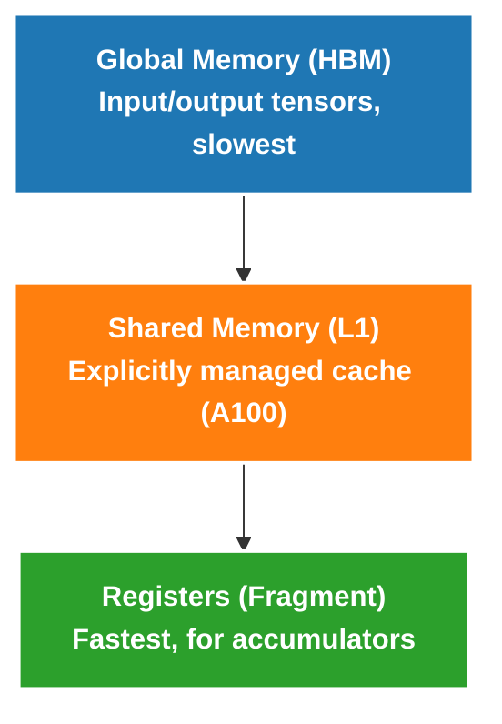
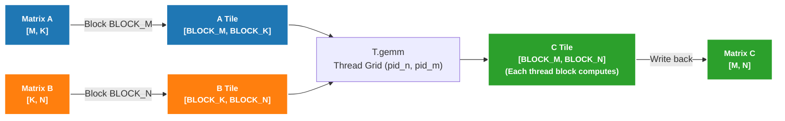

# Matrix Computation Implementation Guide

## Overview

This document explains matrix operation implementation in detail, including matrix-vector multiplication (GEMV) and matrix-matrix multiplication (GEMM).

## Core Concepts

### 1. Mixed Precision Computation

```python
dtype = T.float16        # Input/output use float16
accum_dtype = T.float32  # Accumulator uses float32
```

**Why this design?**
- float16 saves memory bandwidth, Tensor Core natively supports
- float32 accumulator avoids numerical overflow (float16 max ~65504), ensures precision
- This is standard practice for deep learning inference

> Complete code in this document assumes `M % BLOCK_M == 0`, `N % BLOCK_N == 0`, `K % BLOCK_K == 0`.
> Focus on blocking, `T.gemm` and `T.Pipelined` data flow first, boundary handling discussed later.

### 2. Memory Hierarchy Structure



### 3. Tensor Core vs CUDA Core

| Feature | CUDA Core | Tensor Core |
|---------|-----------|-------------|
| Operation Type | Scalar/Vector | Matrix |
| Instruction | FMA | MMA (Matrix Multiply Accumulate) |
| Throughput | Medium | Extremely High (2-8x) |
| TileLang API | Manual loop | `T.gemm()` |

---

## GEMV Implementation Details

### Problem Definition

GEMV (Matrix-Vector Multiplication) computes `C = A @ B`, where:
- `A: [M, K]` - Input matrix
- `B: [K]` - Input vector
- `C: [M]` - Output vector

Mathematical definition:
```
C[i] = Σ_k A[i, k] * B[k]
```

### Blocking Strategy

**Why need blocking?**

Assume M = 4096, K = 4096:
- If not blocked, each thread block needs to process all K=4096 elements
- Not enough registers to store this much data
- Therefore need to block in K dimension, only process BLOCK_K elements at a time

**Computation after blocking**:
```
Original computation: C[i] = Σ_{k=0}^{K-1} A[i, k] * B[k]

Blocked computation: 
  C[i] = 0
  for k_block in range(K // BLOCK_K):
      C[i] += Σ_{k=0}^{BLOCK_K-1} A[i, k_block*BLOCK_K + k] * B[k_block*BLOCK_K + k]
```

### Code Details

```python
@tilelang.jit
def tl_gemv(A, B, BLOCK_M: int, BLOCK_K: int):
    M, K = T.const("M, K")
    dtype = T.float16
    accum_dtype = T.float32
    A: T.Tensor((M, K), dtype)
    B: T.Tensor((K,), dtype)
    C = T.empty((M,), dtype)

    # Parallel in M dimension: launch M // BLOCK_M thread blocks
    # Each thread block processes BLOCK_M rows of output
    with T.Kernel(T.ceildiv(M, BLOCK_M), threads=128) as pid_m:
```

**Step 1: Allocate Registers**

```python
        A_local = T.alloc_fragment((BLOCK_M, BLOCK_K), dtype)
        B_local = T.alloc_fragment((BLOCK_K,), dtype)
        C_local = T.alloc_fragment((BLOCK_M,), accum_dtype)
        AB_temp = T.alloc_fragment((BLOCK_M, BLOCK_K), accum_dtype)
```

| Variable | Shape | Data Type | Description |
|----------|-------|-----------|-------------|
| `A_local` | `[BLOCK_M, BLOCK_K]` | float16 | Store one tile of A (BLOCK_M rows, BLOCK_K columns) |
| `B_local` | `[BLOCK_K]` | float16 | Store one segment of B (BLOCK_K elements) |
| `C_local` | `[BLOCK_M]` | **float32** | Accumulator, store partial sums |
| `AB_temp` | `[BLOCK_M, BLOCK_K]` | float32 | Temporary storage for multiplication results |

**Key Point**: `C_local` and `AB_temp` use float32 to ensure accumulation precision.

**Step 2: Initialize Accumulator**

```python
        T.clear(C_local)
```

**Must clear!** Otherwise `C_local` will contain undefined garbage values.

**Step 3: Serial Traverse K Dimension**

```python
        for k in T.Serial(K // BLOCK_K):
            # Load A tile
            T.copy(A[pid_m * BLOCK_M, k * BLOCK_K], A_local)
            # Load B tile
            T.copy(B[k * BLOCK_K], B_local)
```

**Step 4: Element-wise Multiplication + Reduction**

```python
            for i, j in T.Parallel(BLOCK_M, BLOCK_K):
                AB_temp[i, j] = A_local[i, j].astype(accum_dtype) * B_local[j].astype(accum_dtype)

            T.reduce_sum(AB_temp, C_local, dim=1, clear=False)
```

- `T.Parallel` lets all threads compute in parallel
- `astype(accum_dtype)` explicitly converts to float32 to ensure precision
- `reduce_sum(..., dim=1)` sums along K dimension
- `clear=False` means accumulate to existing value, not overwrite

**Step 5: Write Back Result**

```python
        T.copy(C_local, C[pid_m * BLOCK_M])
```

### Dimension Correspondence

```
A: [M, K]  →  A_local: [BLOCK_M, BLOCK_K]
B: [K]     →  B_local: [BLOCK_K]
C: [M]     →  C_local: [BLOCK_M]

reduce_sum along dim=1 (K dimension):
  AB_temp: [BLOCK_M, BLOCK_K] → C_local: [BLOCK_M]
```

---

## GEMM Naive Implementation Details

### Problem Definition

GEMM (Matrix-Matrix Multiplication) computes `C = A @ B`, where:
- `A: [M, K]` - Left matrix
- `B: [K, N]` - Right matrix
- `C: [M, N]` - Output matrix

Mathematical definition:
```
C[i, j] = Σ_k A[i, k] * B[k, j]
```

### GEMV vs GEMM Comparison

| Feature | GEMV | GEMM |
|---------|------|------|
| Output Dimension | `[M]` (vector) | `[M, N]` (matrix) |
| Number of Thread Blocks | M // BLOCK_M | (M // BLOCK_M) × (N // BLOCK_N) |
| Computational Complexity | O(M × K) | O(M × N × K) |
| Key Operation | reduce_sum | T.gemm (Tensor Core) |

### Blocking Strategy Diagram



### Code Details

```python
@tilelang.jit
def tl_matmul_naive(A, B, BLOCK_M: int, BLOCK_N: int, BLOCK_K: int):
    M, N, K = T.const("M, N, K")
    dtype = T.float16
    accum_dtype = T.float32
    A: T.Tensor((M, K), dtype)
    B: T.Tensor((K, N), dtype)
    C = T.empty((M, N), dtype)

    # 2D grid: Parallel in N and M dimensions
    # Note: Kernel parameter order is (grid_x, grid_y), corresponding to (pid_n, pid_m)
    with T.Kernel(T.ceildiv(N, BLOCK_N), T.ceildiv(M, BLOCK_M), threads=128) as (pid_n, pid_m):
```

**Kernel Parameter Order**:
- First parameter `T.ceildiv(N, BLOCK_N)` determines grid's x dimension
- Second parameter `T.ceildiv(M, BLOCK_M)` determines grid's y dimension
- `pid_n` corresponds to N dimension (B's columns)
- `pid_m` corresponds to M dimension (A's rows)

**Step 1: Allocate Registers**

```python
        A_frag = T.alloc_fragment((BLOCK_M, BLOCK_K), dtype)
        B_frag = T.alloc_fragment((BLOCK_K, BLOCK_N), dtype)
        C_frag = T.alloc_fragment((BLOCK_M, BLOCK_N), accum_dtype)
```

**Step 2: Initialize Accumulator**

```python
        T.clear(C_frag)
```

**Step 3: Serial Traverse K Dimension + Tensor Core Computation**

```python
        for k in T.Serial(K // BLOCK_K):
            # Load A tile
            T.copy(A[pid_m * BLOCK_M, k * BLOCK_K], A_frag)
            # Load B tile
            T.copy(B[k * BLOCK_K, pid_n * BLOCK_N], B_frag)
            # Compute using Tensor Core
            T.gemm(A_frag, B_frag, C_frag)
```

**Step 4: Write Back Result**

```python
        T.copy(C_frag, C[pid_m * BLOCK_M, pid_n * BLOCK_N])
```

**Purpose of `T.gemm`**:
1. Automatically generates efficient MMA instructions using Tensor Core
2. Result accumulates to `C_frag`, not overwrites
3. Supports Fragment, Shared Memory as input

### Why Isn't Naive Implementation Fast Enough?

**Problem 1: Register Pressure**

```
In naive implementation, A_frag, B_frag, C_frag are all in registers:
- A_frag: BLOCK_M × BLOCK_K × 2 bytes (float16)
- B_frag: BLOCK_K × BLOCK_N × 2 bytes (float16)
- C_frag: BLOCK_M × BLOCK_N × 4 bytes (float32)

When BLOCK_M=128, BLOCK_N=128, BLOCK_K=64:
- Total register usage = 128×64×2 + 64×128×2 + 128×128×4
                      = 16KB + 16KB + 64KB = 96KB

The byte count here is just teaching intuition for order of magnitude, not precise "per-thread register accounting".
Real lowering redistributes resources among warp/MMA/temporary registers, but conclusion remains:
When A, B, C tiles are all kept in Fragment, register pressure increases significantly, affecting occupancy, potentially triggering spilling.

Result: Register spilling, significant performance drop
```

**Problem 2: Memory Latency Not Hidden**

```
Naive version execution order:
Iteration 0: [Load A0, B0] → [Compute C0]
Iteration 1:               [Load A1, B1] → [Compute C1]
Iteration 2:                              [Load A2, B2] → [Compute C2]

Memory loading and computation are serial, GPU compute units idle while waiting for memory
```

---

## GEMM Optimized Implementation Details

### Optimization 1: Use Shared Memory

```python
@tilelang.jit
def tl_matmul_opt(A, B, BLOCK_M: int, BLOCK_N: int, BLOCK_K: int):
    # ...
    with T.Kernel(T.ceildiv(N, BLOCK_N), T.ceildiv(M, BLOCK_M), threads=128) as (pid_n, pid_m):
        # Naive version: All use Fragment (registers)
        # A_frag = T.alloc_fragment((BLOCK_M, BLOCK_K), dtype)
        # B_frag = T.alloc_fragment((BLOCK_K, BLOCK_N), dtype)

        # Optimized version: A and B use shared memory
        A_shared = T.alloc_shared((BLOCK_M, BLOCK_K), dtype)
        B_shared = T.alloc_shared((BLOCK_K, BLOCK_N), dtype)
        # C accumulator still uses Fragment, because frequent read/write needed
        C_local = T.alloc_fragment((BLOCK_M, BLOCK_N), accum_dtype)
```

**Why Shared Memory Better for Optimized Version?**

| Feature | Fragment (registers) | Shared Memory |
|---------|---------------------|---------------|
| Capacity | Limited | Larger |
| Access Speed | Fastest | Faster than global memory |
| Visibility | Thread-private | Block-shared |
| Use Case | Accumulators, temporary variables | Input data tiles |

Note here:
- `T.gemm` doesn't "only eat Shared Memory"
- Naive version already proved Fragment input works
- Optimized version switches to Shared Memory to better balance register usage, data reuse and pipeline scheduling

**Why C Accumulator Still Uses Fragment?**

- C needs frequent accumulation during K dimension iteration (read/write each gemm)
- Fragment (register) access is fastest
- A and B only need to be loaded once, then used and done, shared memory is sufficient

### Optimization 2: Software Pipeline

```python
        # Naive version: Serial execution
        # for k in T.Serial(K // BLOCK_K):
        #     T.copy(...)  # Load
        #     T.gemm(...)  # Compute

        # Optimized version: Pipeline execution
        for k in T.Pipelined(K // BLOCK_K, num_stages=3):
            T.copy(A[pid_m * BLOCK_M, k * BLOCK_K], A_shared)
            T.copy(B[k * BLOCK_K, pid_n * BLOCK_N], B_shared)
            T.gemm(A_shared, B_shared, C_local)

        # Write back result
        T.copy(C_local, C[pid_m * BLOCK_M, pid_n * BLOCK_N])
```

**Pipeline Principle**:

```
3-stage pipeline execution order:

Time →
Iteration 0: [Load A0, B0]
Iteration 1: [Load A1, B1] [Compute C0]  ← Overlap!
Iteration 2: [Load A2, B2] [Compute C1]  ← Overlap!
Iteration 3:                   [Compute C2]

Effect: Computation and memory access execute in parallel, hide memory latency
```

**`num_stages` Selection**:

| num_stages | Effect | Shared Memory Overhead |
|------------|--------|------------------------|
| 1 | No pipeline (serial) | 1x |
| 2 | Double buffering, moderate optimization | 2x |
| 3 | 3-stage pipeline, recommended | 3x |
| 4+ | Diminishing returns | 4x+ |

**Recommendation**: Start with `num_stages=3`, lower if shared memory or occupancy pressure is too high.

### Shared Memory Size Calculation

```python
# Example with BLOCK_M=128, BLOCK_N=128, BLOCK_K=64, num_stages=3:
A_shared_size = 128 × 64 × 2 bytes × 3 stages = 48 KB
B_shared_size = 64 × 128 × 2 bytes × 3 stages = 48 KB
C_frag_size = 128 × 128 × 4 bytes = 64 KB (registers)

Total shared memory ≈ 96 KB, within A100's shared memory limit
```

---

## Performance Optimization Points

### 1. Block Size Selection

| GPU Architecture | Recommended Block Size | Notes |
|-----------------|----------------------|-------|
| Ampere (A100) | 128×128×32 | Balance register and shared memory usage |
| Hopper (H100) | 256×128×32 | Larger shared memory, can support larger blocks |

### 2. Pipeline Depth

- `num_stages=1`: No pipeline (serial)
- `num_stages=2`: 2-stage pipeline (double buffering)
- `num_stages=3`: 3-stage pipeline (recommended, suitable for most cases)
- `num_stages=4+`: Diminishing returns, increases shared memory pressure

### 3. Why Shared Memory + Pipeline Faster?

```
Naive version (Fragment + Serial):
  Iteration 0: [Load A] [Load B] [Compute] 
  Iteration 1:          [Load A] [Load B] [Compute]
  Iteration 2:                   [Load A] [Load B] [Compute]

Optimized version (Shared Memory + Pipeline):
  Iteration 0: [Load A0] [Load B0]
  Iteration 1: [Load A1] [Load B1] [Compute C0]
  Iteration 2: [Load A2] [Load B2] [Compute C1]
  Iteration 3:                   [Compute C2]
```

Pipeline overlaps computation and memory access, hiding memory latency.

---

## Numerical Precision Issues

### float16 Precision Limitations

When testing large matrix multiplication (e.g., M=N=K=4096), results may not match exactly:

```
❌ Results match: False
Max diff: tensor(0.25)
Mean diff: tensor(0.0095)
```

**This is normal**, reasons:

| Factor | Impact |
|--------|--------|
| K=4096 accumulation | 4096 multiply-add operations, error accumulates |
| float16 precision | Only 3-4 significant digits, max ~65504 |
| Tensor Core rounding | Different rounding methods may produce tiny differences |

## Boundary Checking (Optional)

The above code assumes matrix dimensions M, N, K are divisible by corresponding BLOCK sizes. In **production environments**, boundary checking needs to be added to handle arbitrary sizes:

```python
# Check boundary when loading
A_shared[i, j] = T.if_then_else(
    by * BLOCK_M + i < M and k * BLOCK_K + j < K,
    A[by * BLOCK_M + i, k * BLOCK_K + j],
    0,  # Out-of-bounds fill with 0, doesn't affect accumulation result
)
```

Boundary checking brings minor performance overhead, but gains:
- Support for arbitrary matrix sizes
- Avoid GPU program crashes or wrong results

**Demo scenarios** can omit this, use divisible matrix sizes. Complete code above assumes all three dimensions are divisible by corresponding blocks; if only grid is changed to `T.ceildiv` but loading and write-back don't have masks, the last block may still go out of bounds.

---

## Further Reading

1. [CUDA C Programming Guide - Shared Memory](https://docs.nvidia.com/cuda/cuda-c-programming-guide/index.html#shared-memory)
2. [NVIDIA Tensor Core](https://developer.nvidia.com/tensor-cores)
3. [FlashAttention: Fast and Memory-Efficient Exact Attention](https://arxiv.org/abs/2205.14135)
