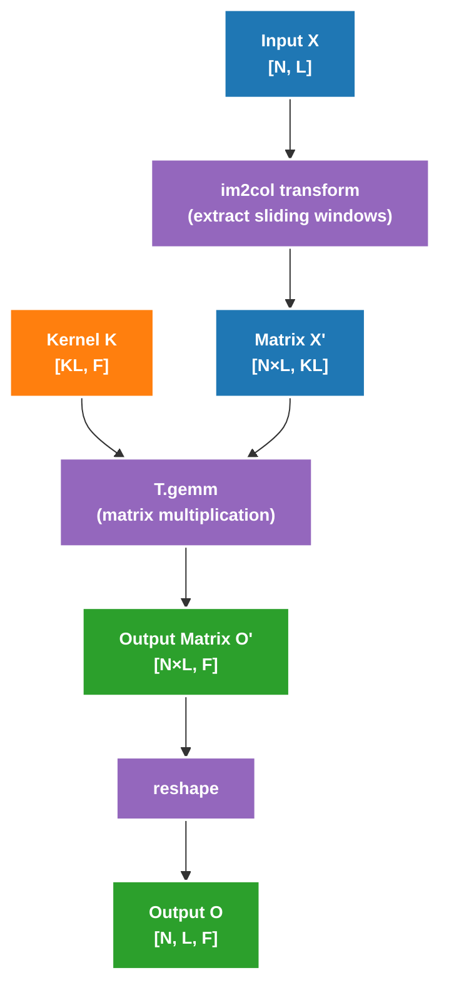

# Puzzle 09: Convolution Code Analysis

## Overview

This puzzle introduces another core computation pattern in deep learning: **Convolution Operation**. Convolution is widely used in computer vision and deep learning, and is the core operator of CNN (Convolutional Neural Networks).

## Why Is Convolution So Important?

In deep learning, convolution operations are everywhere:
- **Image Recognition**: Convolution layers in CNN extract image features
- **Natural Language Processing**: 1D convolution for text sequence processing
- **Speech Recognition**: Convolution processing of time-series signals
- **Video Analysis**: 3D convolution processing spatiotemporal features

Characteristics of convolution:
- **Local Connectivity**: Each output only depends on a local region of input
- **Parameter Sharing**: Same convolution kernel shares parameters at all positions
- **Strong Data Reuse**: Adjacent outputs share most input data

---

## Part 1: 1D Convolution

### Problem Definition

**Input**:
- `X: [N, L]` - Input tensor (float16)
- `K: [KL]` - Convolution kernel (float16)
- `N: int` - Batch size, 1 ≤ N ≤ 64
- `L: int` - Sequence length, 1 ≤ L ≤ 1024
- `KL: int` - Kernel length, 1 ≤ KL ≤ 32

**Output**:
- `O: [N, L]` - Output tensor (float16)

**Intermediate Variables**:
- `ACC: float32` - Accumulator

**Computation Definition**:
```python
for i in range(N):
    for j in range(L):
        ACC = 0
        for k in range(KL):
            if j + k < L:  # Boundary check
                ACC += X[i, j + k] * K[k]
        O[i, j] = ACC
```

### Intuitive Understanding

Assume `X` is a sequence of length 5, `K` is a kernel of length 3:

```
X = [1, 2, 3, 4, 5]
K = [a, b, c]

Sliding window computation:
j=0: O[0] = X[0]*a + X[1]*b + X[2]*c = 1*a + 2*b + 3*c
j=1: O[1] = X[1]*a + X[2]*b + X[3]*c = 2*a + 3*b + 4*c
j=2: O[2] = X[2]*a + X[3]*b + X[4]*c = 3*a + 4*b + 5*c
j=3: O[3] = X[3]*a + X[4]*b + X[5]*c = 4*a + 5*b + 0*c (boundary)
j=4: O[4] = X[4]*a + X[5]*b + X[6]*c = 5*a + 0*b + 0*c (boundary)
```

### Data Reuse Pattern

One prominent feature of convolution is data reuse:

```
Input sequence: X = [x0, x1, x2, x3, x4, x5, ...]
Kernel:   K = [k0, k1, k2]

Computing O[0] needs: X[0], X[1], X[2]
Computing O[1] needs: X[1], X[2], X[3]  ← X[1], X[2] reused
Computing O[2] needs: X[2], X[3], X[4]  ← X[2], X[3] reused
...
```

Each input element is used by multiple output positions, providing optimization opportunities.

### PyTorch Reference Implementation

```python
def ref_conv1d(X: torch.Tensor, K: torch.Tensor):
    assert len(X.shape) == 2
    assert len(K.shape) == 1
    assert X.dtype == K.dtype == torch.float16

    N, L = X.shape
    KL = K.shape[0]

    # Add padding to maintain output length
    padding_size = KL - 1
    X_padded = torch.nn.functional.pad(X.view(N, 1, L), (0, padding_size))

    return torch.conv1d(
        input=X_padded,
        weight=K.view(1, 1, KL),
    ).view(N, L)
```

### Implementation Framework

```python
@tilelang.jit(
    pass_configs={
        tilelang.PassConfigKey.TL_DISABLE_WARP_SPECIALIZED: True,
        tilelang.PassConfigKey.TL_DISABLE_TMA_LOWER: True,
    },
)
def tl_conv1d_naive(X, K, BLOCK_N: int, BLOCK_L: int):
    N, L, KL = T.const("N, L, KL")
    dtype = T.float16
    accum_dtype = T.float32
    X: T.Tensor((N, L), dtype)
    K: T.Tensor((KL,), dtype)
    O = T.empty((N, L), dtype)

    # TODO: Implement this function
    # Hints:
    # 1. Use T.ceildiv to handle non-divisible cases
    # 2. Block in N and L dimensions
    # 3. Note boundary checking (needed at load, compute, write-back)

    return O
```

---

## Part 2: Multi-Output Channel 1D Convolution

### Problem Definition

To better utilize Tensor Core and `T.gemm`, we introduce output channel dimension F.

**Input**:
- `X: [N, L]` - Input tensor (float16)
- `K: [KL, F]` - Convolution kernel (float16)
- `N: int` - Batch size
- `L: int` - Sequence length
- `KL: int` - Kernel length
- `F: int` - Output channels, 32 ≤ F ≤ 128

**Output**:
- `O: [N, L, F]` - Output tensor (float16)

**Intermediate Variables**:
- `ACC: float32` - Accumulator

**Computation Definition**:
```python
for i in range(N):
    for j in range(L):
        for f in range(F):
            ACC = 0
            for k in range(KL):
                if j + k < L:
                    ACC += X[i, j + k] * K[k, f]
            O[i, j, f] = ACC
```

### Relationship with Matrix Multiplication (im2col)

Convolution can be converted to matrix multiplication, the famous **im2col (image to column)** technique:



**im2col Example**:

```
Input X = [1, 2, 3, 4, 5] (L=5)
Kernel length KL = 3

Matrix X' after im2col:
[[1, 2, 3],   # Corresponds to O[0]
 [2, 3, 4],   # Corresponds to O[1]
 [3, 4, 5],   # Corresponds to O[2]
 [4, 5, 0],   # Corresponds to O[3] (boundary padding)
 [5, 0, 0]]   # Corresponds to O[4] (boundary padding)
```

This way, convolution becomes matrix multiplication `X' @ K`, can efficiently compute using Tensor Core.

### PyTorch Reference Implementation

```python
def ref_conv1d_multi_outchannel(X: torch.Tensor, K: torch.Tensor):
    assert len(X.shape) == 2
    assert len(K.shape) == 2
    assert X.dtype == K.dtype == torch.float16

    N, L = X.shape
    KL, F = K.shape

    padding_size = KL - 1
    X_padded = torch.nn.functional.pad(X.view(N, 1, L), (0, padding_size))

    return (
        torch.conv1d(
            input=X_padded,
            weight=K.permute(1, 0).view(F, 1, KL),
        )
        .permute(0, 2, 1)
        .contiguous()
    )
```

### Implementation Framework (Naive Version)

```python
@tilelang.jit(
    pass_configs={
        tilelang.PassConfigKey.TL_DISABLE_WARP_SPECIALIZED: True,
        tilelang.PassConfigKey.TL_DISABLE_TMA_LOWER: True,
    },
)
def tl_conv1d_multi_outchannel(X, K, BLOCK_N: int, BLOCK_L: int):
    N, L, KL, F = T.const("N, L, KL, F")
    dtype = T.float16
    accum_dtype = T.float32
    X: T.Tensor((N, L), dtype)
    K: T.Tensor((KL, F), dtype)
    O = T.empty((N, L, F), dtype)

    # TODO: Implement this function
    # Hints:
    # 1. Use T.ceildiv to handle non-divisible cases
    # 2. Block in N, L, F dimensions
    # 3. Handle boundary conditions (load, compute, write-back)

    return O
```

### Implementation Framework (im2col + GEMM)

```python
@tilelang.jit(
    pass_configs={
        tilelang.PassConfigKey.TL_DISABLE_WARP_SPECIALIZED: True,
        tilelang.PassConfigKey.TL_DISABLE_TMA_LOWER: True,
    },
)
def tl_conv1d_img2col(X, K, BLOCK_N: int, BLOCK_L: int):
    N, L, KL, F = T.const("N, L, KL, F")
    dtype = T.float16
    accum_dtype = T.float32
    X: T.Tensor((N, L), dtype)
    K: T.Tensor((KL, F), dtype)
    O = T.empty((N, L, F), dtype)

    # TODO: Implement im2col + GEMM optimized version
    # Hints:
    # 1. Use T.ceildiv to handle non-divisible cases
    # 2. Use shared memory to store im2col transformed X tile
    # 3. Use T.gemm for matrix multiplication
    # 4. Note boundary checking

    return O
```

---

## Core Concepts

### 1. Shared Memory in Convolution

Convolution's data reuse characteristic is very suitable for using shared memory:

```python
# Load input tile to shared memory (including halo region)
X_shared = T.alloc_shared((BLOCK_N, BLOCK_L + KL - 1), dtype)

# Multiple output positions can reuse data in X_shared
# No need to repeatedly read from global memory
```

The exact receptive field for an output tile of width `BLOCK_L` is `BLOCK_L + KL - 1`. If you choose to allocate a slightly larger buffer for teaching simplicity, make that explicit so readers know it is a conservative over-allocation rather than a mathematical requirement.

**Advantages**:
- Reduce HBM (global memory) access
- Utilize data reuse characteristic
- Improve memory bandwidth utilization

### 2. im2col Implementation on GPU

On GPU, we can:
- **Dynamic im2col**: Build im2col matrix on-the-fly inside kernel
- **Implicit im2col**: Don't explicitly store im2col matrix, but dynamically compute indices during access

```python
# Implicit im2col
for k in range(KL):
    x_idx = j + k  # Dynamically compute index
    if x_idx < L:
        ACC += X[i, x_idx] * K[k]
```

### 3. Boundary Handling

#### Why Is Boundary Handling Important?

In real scenarios, input dimensions are often **not multiples of block size**:

```python
# Real scenario examples
image_sizes = [224, 384, 512, 640, 768]  # Image sizes not divisible
prompt_lengths = [23, 87, 156, 342]       # NLP sequence lengths not divisible
batch_sizes = [1, 3, 7, 12, 31]           # Batch sizes not divisible
```

#### Using ceildiv + Boundary Checking

```python
# Using ceildiv + boundary checking
with T.Kernel(T.ceildiv(N, BLOCK_N), T.ceildiv(L, BLOCK_L), ...) as (pid_n, pid_l):
    # Check boundary when loading
    for i, j in T.Parallel(BLOCK_N, BLOCK_L + KL - 1):
        X_shared[i, j] = T.if_then_else(
            pid_n * BLOCK_N + i < N and pid_l * BLOCK_L + j < L,
            X[pid_n * BLOCK_N + i, pid_l * BLOCK_L + j],
            0,  # Fill 0 outside boundary
        )
    
    # Check boundary when computing
    temp[i, kl] = T.if_then_else(
        pid_l * BLOCK_L + l + kl < L,
        X_shared[i, l + kl] * K_local[kl],
        0,
    )
    
    # Check boundary when writing back
    if pid_n * BLOCK_N + i < N and pid_l * BLOCK_L + l < L:
        O[pid_n * BLOCK_N + i, pid_l * BLOCK_L + l] = O_local[i]
```

#### Boundary Handling Three Steps

| Step | Location | Check Content |
|------|----------|--------------|
| Load | Read from global memory | Whether index out of bounds, fill 0 if out |
| Compute | Convolution computation | Whether output position + kernel offset out of bounds |
| Write-back | Write to global memory | Whether output position in valid range |

---

## Comparison with Matrix Multiplication

| Feature | GEMM (Puzzle 08) | Conv1D (Puzzle 09) |
|---------|------------------|-------------------|
| Input Dimensions | A[M, K], B[K, N] | X[N, L], K[KL, F] |
| Output Dimensions | C[M, N] | O[N, L, F] |
| Core Operation | T.gemm | T.gemm (after im2col) |
| Data Reuse | Regular | Sliding window |
| Boundary Handling | Not needed | **Must handle** |
| Optimization Technique | Shared Memory + Pipeline | im2col + GEMM |

---

## Performance Optimization Points

### 1. im2col vs Naive Implementation

```
Naive implementation:
- Flexible, applicable to any convolution configuration
- Irregular data access, low cache utilization

im2col + GEMM:
- Regular matrix multiplication, high cache utilization
- Can utilize Tensor Core
- Requires extra im2col transformation overhead
```

### 2. Shared Memory Usage

```python
# When loading input, consider halo region (kernel range)
# Load BLOCK_L + KL - 1 elements at once
X_shared = T.alloc_shared((BLOCK_N, BLOCK_L + KL - 1), dtype)
```

### 3. Software Pipeline

```python
for k in T.Pipelined(KL, num_stages=2):
    # Overlap data loading and computation
    T.copy(X[...], X_shared)
    T.gemm(X_shared, K_frag, O_frag)
```

---
## Further Reading

1. **Convolution Optimization**: Winograd algorithm, FFT convolution, direct convolution
2. **im2col**: cuDNN's convolution implementation method
3. **Deep Learning Frameworks**: How PyTorch/TensorFlow implement convolution
4. **Tensor Core**: NVIDIA's matrix computation acceleration unit
5. **Winograd Algorithm**: Algorithm to reduce convolution computation
