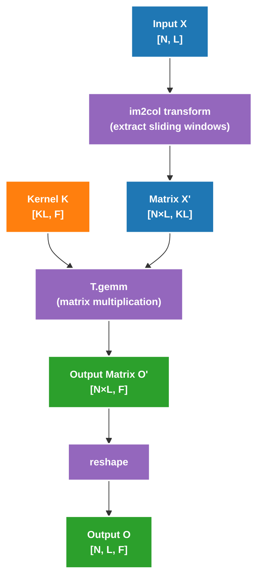

# Convolution Implementation Guide

## Overview

This document explains in detail how to implement efficient 1D convolution operators, including naive implementation and im2col-based optimized implementation.

## Core Constraints

Key characteristics of convolution are **data dependency** and **boundary handling**:

- **Data Dependency**: Each output position depends on sliding window of input
- **Boundary Handling**: Need to handle boundary conditions at sequence end (**must use ceildiv**)
- **Data Reuse**: Adjacent outputs share most input data

---

## Part 1: Conv1D Naive Implementation

### Implementation Approach

1. **Parallel Strategy**: Block in N and L dimensions, each block processes one output tile
2. **Serial Computation**: Serial traverse in KL dimension, accumulate results
3. **Boundary Handling**: Use `T.ceildiv` + `T.if_then_else` to handle boundaries

### Complete Implementation

```python
@tilelang.jit(
    pass_configs={
        tilelang.PassConfigKey.TL_DISABLE_WARP_SPECIALIZED: True,
        tilelang.PassConfigKey.TL_DISABLE_TMA_LOWER: True,
    },
)
def tl_conv1d_naive(X, K, BLOCK_N: int, BLOCK_L: int):
    N, L, KL = T.const("N, L, KL")
    dtype = T.float16
    accum_dtype = T.float32
    X: T.Tensor((N, L), dtype)
    K: T.Tensor((KL,), dtype)
    O = T.empty((N, L), dtype)

    # Use T.ceildiv to handle non-divisible cases
    with T.Kernel(T.ceildiv(N, BLOCK_N), T.ceildiv(L, BLOCK_L), threads=256) as (pid_n, pid_l):
        X_shared = T.alloc_shared((BLOCK_N, BLOCK_L + KL - 1), dtype)
        K_local = T.alloc_fragment((KL), dtype)
        O_local = T.alloc_shared((BLOCK_N,), accum_dtype)

        temp = T.alloc_fragment((BLOCK_N, KL), accum_dtype)  # temporary buffer for reduce

        # Check boundary when loading data, avoid out-of-bounds read
        for i, j in T.Parallel(BLOCK_N, BLOCK_L + KL - 1):
            X_shared[i, j] = T.if_then_else(
                pid_n * BLOCK_N + i < N and pid_l * BLOCK_L + j < L,
                X[pid_n * BLOCK_N + i, pid_l * BLOCK_L + j],
                0,
            )
        T.copy(K, K_local)

        for l in T.Serial(BLOCK_L):
            for i, kl in T.Parallel(BLOCK_N, KL):
                # Boundary check: ensure not out of bounds
                temp[i, kl] = T.if_then_else(
                    pid_l * BLOCK_L + l + kl < L,
                    X_shared[i, l + kl].astype(accum_dtype) * K_local[kl].astype(accum_dtype),
                    0,
                )
            T.reduce_sum(temp, O_local, dim=-1, clear=True)
            # Check boundary when writing back
            for i in T.Parallel(BLOCK_N):
                if pid_n * BLOCK_N + i < N and pid_l * BLOCK_L + l < L:
                    O[pid_n * BLOCK_N + i, pid_l * BLOCK_L + l] = O_local[i].astype(dtype)

    return O
```

### Key Code Analysis

#### 1. Using ceildiv 

```python
# Using ceildiv
with T.Kernel(T.ceildiv(N, BLOCK_N), T.ceildiv(L, BLOCK_L), ...) as (pid_n, pid_l):
```

**Reason**: When N=130, BLOCK_N=16:
- `N // BLOCK_N = 8`, only launch 8 blocks, process 128 elements, **lose last 2**
- `T.ceildiv(N, BLOCK_N) = 9`, launch 9 blocks, correctly process all 130 elements

#### 2. Boundary Checking When Loading

```python
for i, j in T.Parallel(BLOCK_N, BLOCK_L + KL - 1):
    X_shared[i, j] = T.if_then_else(
        pid_n * BLOCK_N + i < N and pid_l * BLOCK_L + j < L,
        X[pid_n * BLOCK_N + i, pid_l * BLOCK_L + j],
        0,  # Fill 0 for out-of-bounds positions
    )
```

#### 3. Boundary Checking When Computing

```python
temp[i, kl] = T.if_then_else(
    pid_l * BLOCK_L + l + kl < L,
    X_shared[i, l + kl].astype(accum_dtype) * K_local[kl].astype(accum_dtype),
    0,  # Fill 0 when kernel exceeds boundary
)
```

#### 4. Boundary Checking When Writing Back

```python
for i in T.Parallel(BLOCK_N):
    if pid_n * BLOCK_N + i < N and pid_l * BLOCK_L + l < L:
        O[pid_n * BLOCK_N + i, pid_l * BLOCK_L + l] = O_local[i].astype(dtype)
```

---

## Part 2: Conv1D Multi-Output Channel

### Implementation Approach

Extend naive implementation, add output channel dimension F. Since problem gives F ∈ [32, 128], can directly process all F, no need to block.

### Complete Implementation

```python
@tilelang.jit(
    pass_configs={
        tilelang.PassConfigKey.TL_DISABLE_WARP_SPECIALIZED: True,
        tilelang.PassConfigKey.TL_DISABLE_TMA_LOWER: True,
    },
)
def tl_conv1d_multi_outchannel(X, K, BLOCK_N: int, BLOCK_L: int):
    N, L, KL, F = T.const("N, L, KL, F")
    dtype = T.float16
    accum_dtype = T.float32
    X: T.Tensor((N, L), dtype)
    K: T.Tensor((KL, F), dtype)
    O = T.empty((N, L, F), dtype)

    # Use T.ceildiv to handle non-divisible cases
    with T.Kernel(T.ceildiv(N, BLOCK_N), T.ceildiv(L, BLOCK_L), threads=256) as (pid_n, pid_l):
        X_shared = T.alloc_shared((BLOCK_N, BLOCK_L + KL - 1), dtype)
        K_local = T.alloc_fragment((KL, F), dtype)
        O_local = T.alloc_shared((BLOCK_N, F), accum_dtype)

        temp = T.alloc_fragment((BLOCK_N, KL, F), accum_dtype)  # temporary buffer for reduce

        # Check boundary when loading data, avoid out-of-bounds read
        for i, j in T.Parallel(BLOCK_N, BLOCK_L + KL - 1):
            X_shared[i, j] = T.if_then_else(
                pid_n * BLOCK_N + i < N and pid_l * BLOCK_L + j < L,
                X[pid_n * BLOCK_N + i, pid_l * BLOCK_L + j],
                0,
            )
        T.copy(K, K_local)

        for l in T.Serial(BLOCK_L):
            for i, f, kl in T.Parallel(BLOCK_N, F, KL):
                # Boundary check: ensure not out of bounds
                temp[i, kl, f] = T.if_then_else(
                    pid_l * BLOCK_L + l + kl < L,
                    X_shared[i, l + kl].astype(accum_dtype) * K_local[kl, f].astype(accum_dtype),
                    0,
                )
            T.reduce_sum(temp, O_local, dim=1, clear=True)
            # Check boundary when writing back
            for i, f in T.Parallel(BLOCK_N, F):
                if pid_n * BLOCK_N + i < N and pid_l * BLOCK_L + l < L:
                    O[pid_n * BLOCK_N + i, pid_l * BLOCK_L + l, f] = O_local[i, f].astype(dtype)

    return O
```

### Differences from Single-Channel Version

| Aspect | Single-Channel Version | Multi-Channel Version |
|--------|------------------------|----------------------|
| K Shape | `[KL]` | `[KL, F]` |
| O Shape | `[N, L]` | `[N, L, F]` |
| temp Shape | `[BLOCK_N, KL]` | `[BLOCK_N, KL, F]` |
| Reduce Dimension | `dim=-1` | `dim=1` |

---

## Part 3: Conv1D im2col Optimized Implementation

### Core Idea

Use im2col to convert convolution to matrix multiplication:



### Complete Implementation

```python
@tilelang.jit(
    pass_configs={
        tilelang.PassConfigKey.TL_DISABLE_WARP_SPECIALIZED: True,
        tilelang.PassConfigKey.TL_DISABLE_TMA_LOWER: True,
    },
)
def tl_conv1d_img2col(X, K, BLOCK_N: int, BLOCK_L: int):
    N, L, KL, F = T.const("N, L, KL, F")
    dtype = T.float16
    accum_dtype = T.float32
    X: T.Tensor((N, L), dtype)
    K: T.Tensor((KL, F), dtype)
    O = T.empty((N, L, F), dtype)

    # Use T.ceildiv to handle non-divisible cases
    with T.Kernel(T.ceildiv(N, BLOCK_N), T.ceildiv(L, BLOCK_L), threads=256) as (pid_n, pid_l):
        X_shared = T.alloc_shared((BLOCK_N, BLOCK_L + KL - 1), dtype)
        K_shared = T.alloc_shared((KL, F), dtype)
        O_local = T.alloc_fragment((BLOCK_N * BLOCK_L, F), accum_dtype)

        # Check boundary when loading data
        for i, j, k in T.Parallel(BLOCK_N, BLOCK_L, KL):
            X_shared[i, j + k] = T.if_then_else(
                pid_n * BLOCK_N + i < N and pid_l * BLOCK_L + j + k < L,
                X[pid_n * BLOCK_N + i, pid_l * BLOCK_L + j + k],
                0,
            )
        X_reshaped = T.reshape(X_shared, (BLOCK_N * BLOCK_L, KL))
        T.copy(K, K_shared)
        T.gemm(X_reshaped, K_shared, O_local, clear_accum=True)
        O_reshaped = T.reshape(O_local, (BLOCK_N, BLOCK_L, F))
        # Check boundary when writing back
        for i, j, f in T.Parallel(BLOCK_N, BLOCK_L, F):
            if pid_n * BLOCK_N + i < N and pid_l * BLOCK_L + j < L:
                O[pid_n * BLOCK_N + i, pid_l * BLOCK_L + j, f] = O_reshaped[i, j, f].astype(dtype)

    return O
```

### Key Techniques Explained

#### 1. im2col Index Computation

```python
# im2col essence: X'[n, l, k] = X[n, l + k]
for i, j, k in T.Parallel(BLOCK_N, BLOCK_L, KL):
    X_shared[i, j, k] = T.if_then_else(
        pid_n * BLOCK_N + i < N and pid_l * BLOCK_L + j + k < L,
        X[pid_n * BLOCK_N + i, pid_l * BLOCK_L + j + k],
        0,  # Boundary padding
    )
```

#### 2. T.reshape Tensor Reshaping

```python
# im2col matrix: [BLOCK_N, BLOCK_L, KL] -> [BLOCK_N * BLOCK_L, KL]
X_reshaped = T.reshape(X_shared, (BLOCK_N * BLOCK_L, KL))

# Output matrix: [BLOCK_N * BLOCK_L, F] -> [BLOCK_N, BLOCK_L, F]
O_reshaped = T.reshape(O_local, (BLOCK_N, BLOCK_L, F))
```

#### 3. T.gemm Usage

```python
T.gemm(X_reshaped, K_shared, O_local, clear_accum=True)
```

- `clear_accum=True`: Automatically clear accumulator before computation
- Can utilize Tensor Core acceleration

### Advantages of im2col + GEMM

1. **Utilize Tensor Core**: `T.gemm` can use Tensor Core acceleration
2. **Regular Memory Access**: Matrix multiplication memory access pattern is more regular
3. **Mature Optimization Techniques**: Can reuse all GEMM optimizations

---

## Performance Comparison

### Naive Implementation vs im2col

| Method | Advantages | Disadvantages | Use Cases |
|--------|------------|---------------|-----------|
| Naive Implementation | Simple logic, small memory overhead | Cannot use Tensor Core | Small KL, small F |
| im2col + GEMM | Can use Tensor Core, high performance | Need to build temporary matrix | Large KL and F |

---

## Extending to 2D Convolution

While this puzzle only involves 1D convolution, principles can be extended to 2D:

```python
# 2D convolution definition
for i in range(N):
    for h in range(H):
        for w in range(W):
            for f in range(F):
                ACC = 0
                for kh in range(KH):
                    for kw in range(KW):
                        if h + kh < H and w + kw < W:
                            ACC += X[i, h + kh, w + kw] * K[kh, kw, f]
                O[i, h, w, f] = ACC

# im2col transformation
# X: [N, H, W] → X_col: [N×H×W, KH×KW]
# K: [KH, KW, F] → K_mat: [KH×KW, F]
# O: [N, H, W, F] ← O_mat: [N×H×W, F]
```

---

## Further Reading

1. **cuDNN Convolution Implementation**: How NVIDIA's deep learning library optimizes convolution
2. **Winograd Algorithm**: Reduce convolution computation
3. **Direct Convolution**: Optimization method without im2col
4. **FFT Convolution**: Use Fast Fourier Transform to accelerate large kernels
5. **Depthwise Separable Convolution**: Efficient convolution in MobileNet
