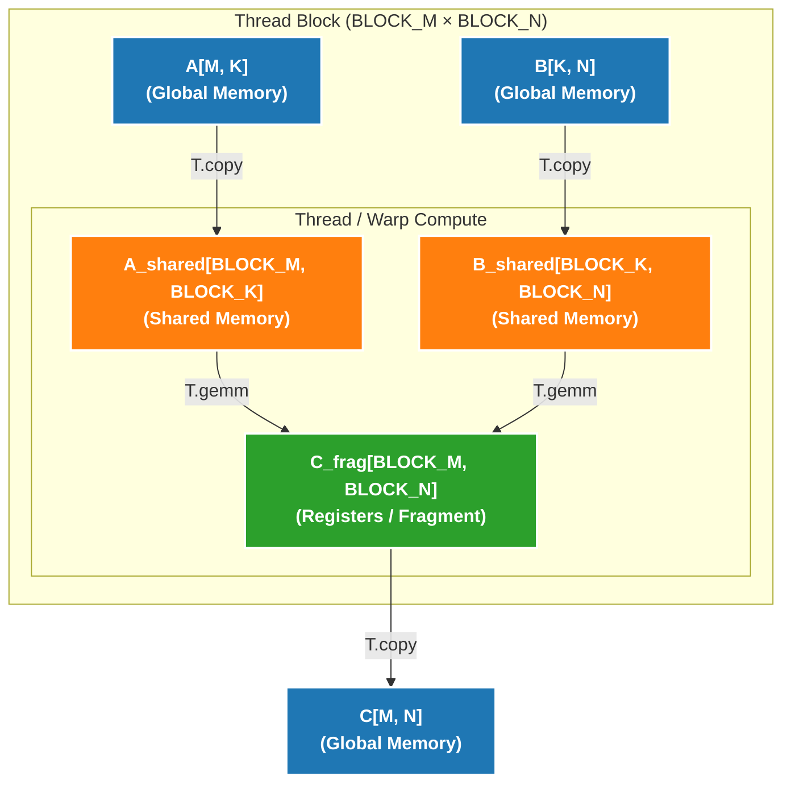

# Puzzle 08: Matrix Computation 代码解析

## 概述

这个 puzzle 是 TileLang 系列中最重要的一章，介绍了深度学习中最基础的计算：**矩阵运算**。我们将从矩阵-向量乘法（GEMV）开始，逐步过渡到矩阵-矩阵乘法（GEMM），并学习如何利用 GPU 的 Tensor Core 实现高性能计算。

## 为什么矩阵运算如此重要？

在深度学习中，几乎所有的计算都可以归结为矩阵运算：
- **全连接层**: `Y = XW + b` (矩阵乘法)
- **注意力机制**: `Attention = softmax(QK^T)V` (多次矩阵乘法)
- **卷积**: 可以转换为矩阵乘法（im2col）

因此，优化矩阵运算的性能直接决定了深度学习模型的训练和推理速度。

## 数据类型说明

从本章开始，我们使用 **float16** 作为输入输出数据类型：

```python
dtype = T.float16        # 输入输出
accum_dtype = T.float32  # 累加器
```

**为什么使用 float16？**
- **现代 AI 硬件优化**: GPU 的 Tensor Core 针对 float16 优化
- **内存带宽**: float16 占用空间是 float32 的一半
- **性能**: float16 计算速度通常是 float32 的 2-8 倍

**为什么累加器用 float32？**
- **数值稳定性**: 大量 float16 累加容易溢出或精度损失
- **混合精度**: 输入 float16，累加 float32，输出 float16

> 本章示例默认 `M % BLOCK_M == 0`、`N % BLOCK_N == 0`、`K % BLOCK_K == 0`，先聚焦分块、Tensor Core 和流水线本身。
> 边界处理会在实现细节部分单独说明。

---

## Part 1: 矩阵-向量乘法 (GEMV)

### 问题定义

**输入**:
- `A: [M, K]` - 矩阵 (float16)
- `B: [K,]` - 向量 (float16)

**输出**:
- `C: [M,]` - 向量 (float16)

**计算定义**:
```python
for i in range(M):
    ACC = 0  # float32 累加器
    for k in range(K):
        ACC += A[i, k] * B[k]
    C[i] = ACC  # 转换回 float16
```

### 直观理解

假设 `A` 是 3×4 矩阵，`B` 是长度为 4 的向量：

```
A = [[1, 2, 3, 4],      B = [1,
     [5, 6, 7, 8],           2,
     [9, 10, 11, 12]]        3,
                             4]

C[0] = 1*1 + 2*2 + 3*3 + 4*4 = 30
C[1] = 5*1 + 6*2 + 7*3 + 8*4 = 70
C[2] = 9*1 + 10*2 + 11*3 + 12*4 = 110
```

### 与 Reduce Sum 的关系

GEMV 本质上是 **加权的 Reduce Sum**：

```python
# Reduce Sum (Puzzle 05)
for i in range(N):
    C[i] = sum(A[i, :])

# GEMV (Puzzle 08)
for i in range(M):
    C[i] = sum(A[i, :] * B[:])  # 加权求和
```

### PyTorch 参考实现

```python
def ref_gemv(A: torch.Tensor, B: torch.Tensor):
    assert A.shape == (M, K)
    assert B.shape == (K,)
    assert A.dtype == B.dtype == torch.float16
    return torch.matmul(input=A, other=B)  # 返回 [M,]
```

### 实现框架

```python
@tilelang.jit
def tl_gemv(A, B, BLOCK_M: int, BLOCK_K: int):
    M, K = T.const("M, K")
    dtype = T.float16
    accum_dtype = T.float32
    A: T.Tensor((M, K), dtype)
    B: T.Tensor((K,), dtype)
    C = T.empty((M,), dtype)

    with T.Kernel(T.ceildiv(M, BLOCK_M), threads=128) as pid_m:
        # 分配局部存储
        A_local = T.alloc_fragment((BLOCK_M, BLOCK_K), dtype)
        B_local = T.alloc_fragment((BLOCK_K,), dtype)
        C_local = T.alloc_fragment((BLOCK_M,), accum_dtype)
        AB_temp = T.alloc_fragment((BLOCK_M, BLOCK_K), accum_dtype)

        # TODO: 完成以下步骤
        # 1. 初始化累加器 T.clear(C_local)
        # 2. 在 K 维度串行遍历，每次处理 BLOCK_K 列
        # 3. 加载 A_local, B_local
        # 4. 计算 AB_temp[i, j] = A_local[i, j] * B_local[j] (需要类型转换)
        # 5. 使用 T.reduce_sum(AB_temp, C_local, dim=1, clear=False) 归约
        # 6. 写回结果 T.copy(C_local, C[...])

    return C
```

---

## Part 2: 矩阵-矩阵乘法 (GEMM) - 朴素版本

### 问题定义

**输入**:
- `A: [M, K]` - 矩阵 (float16)
- `B: [K, N]` - 矩阵 (float16)

**输出**:
- `C: [M, N]` - 矩阵 (float16)

**计算定义**:
```python
for i in range(M):
    for j in range(N):
        ACC = 0  # float32 累加器
        for k in range(K):
            ACC += A[i, k] * B[k, j]
        C[i, j] = ACC
```

### 直观理解

```
A = [[1, 2],      B = [[1, 2, 3],
     [3, 4],           [4, 5, 6]]
     [5, 6]]

C[0,0] = 1*1 + 2*4 = 9
C[0,1] = 1*2 + 2*5 = 12
C[0,2] = 1*3 + 2*6 = 15
C[1,0] = 3*1 + 4*4 = 19
...
```

### 从 GEMV 到 GEMM

GEMM 可以看作是多个 GEMV 的组合：

```python
# GEMV: A[M, K] × B[K,] → C[M,]
C = matmul(A, B)

# GEMM: A[M, K] × B[K, N] → C[M, N]
# 等价于对 B 的每一列做 GEMV
for j in range(N):
    C[:, j] = matmul(A, B[:, j])
```

### Tensor Core 简介

现代 GPU（如 NVIDIA Ampere/Hopper）包含专门的矩阵运算单元：

- **CUDA Core**: 标量/向量运算，灵活但较慢
- **Tensor Core**: 矩阵运算，专用但极快

**Tensor Core 操作示例**:
```
一条 MMA 指令: 16×16×16 FP16 矩阵乘法
输入: A[16, 16], B[16, 16]
输出: C[16, 16] (累加到现有值)
```

**TileLang 的 T.gemm**:
```python
T.gemm(A_frag, B_frag, C_frag, transpose_A=False, transpose_B=False)
```

- 自动调用 Tensor Core 的 MMA 指令
- 处理复杂的内存布局和数据加载
- 支持矩阵转置

教学上可以先把 `T.gemm` 理解成“矩阵版的 FMA”：
- 输入既可以是 Fragment，也可以是 Shared Memory 中的 tile
- 功能上不要求 A、B 必须放在共享内存
- 但在高性能实现里，A、B 往往会先搬到 Shared Memory，再喂给 `T.gemm`

### 实现框架（朴素版本）

```python
@tilelang.jit
def tl_matmul_naive(A, B, BLOCK_M: int, BLOCK_N: int, BLOCK_K: int):
    M, N, K = T.const("M, N, K")
    dtype = T.float16
    accum_dtype = T.float32
    A: T.Tensor((M, K), dtype)
    B: T.Tensor((K, N), dtype)
    C = T.empty((M, N), dtype)

    # TODO: 实现朴素 GEMM
    # 提示:
    # 1. 在 M 和 N 维度分块
    # 2. 在 K 维度串行遍历
    # 3. 使用 T.gemm 进行矩阵乘法
    # 4. 使用 Fragment 存储中间结果

    return C
```

---

## Part 3: GEMM 优化版本

朴素版本虽然能工作，但性能不佳。现代 GPU 编程需要两个关键优化：

### 关键 API 对比

| API | 存储位置 | 用途 | 容量 | 速度 |
|-----|---------|------|------|------|
| `T.alloc_fragment` | 寄存器 | 线程私有数据，累加器 | 小 (~255/线程) | 最快 |
| `T.alloc_shared` | 共享内存 | Block 内共享数据 | 中等 (~164KB/block) | 较快 |

**使用原则**:
- 累加器 C 通常放在 Fragment（频繁读写，延迟最低）
- A、B 的 tile 在教学起步版里可以先用 Fragment，在优化版里再迁移到 Shared Memory
- 当 A、B 放在 Shared Memory 时，`T.gemm` 的 lowering 会处理后续的 MMA 数据加载

### 优化 1: 共享内存 (Shared Memory)

**问题**: Fragment（寄存器）容量有限

在朴素版本中，我们将 A、B、C 的 tile 都存储在 Fragment 中：

```python
A_frag = T.alloc_fragment((BLOCK_M, BLOCK_K), dtype)  # 寄存器
B_frag = T.alloc_fragment((BLOCK_K, BLOCK_N), dtype)  # 寄存器
C_frag = T.alloc_fragment((BLOCK_M, BLOCK_N), accum_dtype)  # 寄存器
```

**问题**:
- 寄存器数量有限（每个线程约 255 个寄存器）
- 大的 BLOCK 会导致寄存器溢出（register spilling）
- 溢出的寄存器会被存储到全局内存，性能急剧下降

**解决方案**: 使用共享内存存储 A 和 B 的 tile

```python
A_shared = T.alloc_shared((BLOCK_M, BLOCK_K), dtype)  # 共享内存
B_shared = T.alloc_shared((BLOCK_K, BLOCK_N), dtype)  # 共享内存
C_frag = T.alloc_fragment((BLOCK_M, BLOCK_N), accum_dtype)  # 寄存器
```

**GPU 内存层次回顾**:



**为什么优化版常把 A、B 放到共享内存？**

Tensor Core 的 MMA 指令需要特定的内存布局：
- 教学上的朴素版本可以直接把 tile 放在 Fragment 中，再交给 `T.gemm`
- 但当 tile 变大时，把 A、B 长时间留在寄存器里会增加寄存器压力，压低 occupancy，甚至引发 spilling
- 因此优化版更常见的做法是把 A、B 放到 Shared Memory，让多个线程复用数据，而把 C 的累加器保留在 Fragment 中

### 优化 2: 软件流水线 (Software Pipeline)

**问题**: 计算和内存访问串行执行

朴素版本的执行流程：

```python
for k in T.Serial(K // BLOCK_K):
    # 步骤1: 加载数据（内存访问）
    T.copy(A[...], A_shared)
    T.copy(B[...], B_shared)
    
    # 步骤2: 计算（Tensor Core）
    T.gemm(A_shared, B_shared, C_frag)
```

**时间线**:
```
迭代0: [加载] [计算] [空闲]
迭代1:         [空闲] [加载] [计算] [空闲]
迭代2:                 [空闲] [加载] [计算]
```

GPU 在加载数据时，Tensor Core 空闲；在计算时，内存控制器空闲。

**解决方案**: 使用软件流水线重叠计算和内存访问

```python
# 使用 T.Pipelined 替代 T.Serial
for k in T.Pipelined(K // BLOCK_K, num_stages=3):
    T.copy(A[...], A_shared)
    T.copy(B[...], B_shared)
    T.gemm(A_shared, B_shared, C_frag)
```

**时间线（3-stage pipeline）**:
```
迭代0: [加载0]
迭代1: [加载1] [计算0]
迭代2: [加载2] [计算1]
迭代3: [加载3] [计算2]
迭代4:         [计算3]
```

**num_stages 参数**:
- `num_stages=1`: 无流水线（等价于 T.Serial）
- `num_stages=2`: 2-stage 流水线（加载下一个块的同时计算当前块）
- `num_stages=3`: 3-stage 流水线（推荐，NVIDIA Ampere+）

**硬件支持**:
- NVIDIA Ampere (A100): 支持 2-3 stage
- NVIDIA Hopper (H100): 支持更多 stage，性能提升更明显

### 实现框架（优化版本）

```python
@tilelang.jit
def tl_matmul_opt(A, B, BLOCK_M: int, BLOCK_N: int, BLOCK_K: int):
    M, N, K = T.const("M, N, K")
    dtype = T.float16
    accum_dtype = T.float32
    A: T.Tensor((M, K), dtype)
    B: T.Tensor((K, N), dtype)
    C = T.empty((M, N), dtype)

    # TODO: 实现优化 GEMM
    # 提示:
    # 1. 使用 T.alloc_shared 分配共享内存
    # 2. 使用 T.Pipelined 替代 T.Serial
    # 3. 设置 num_stages=3

    return C
```

---

## 性能对比

代码会输出三个版本的性能：

1. **TL Naive**: 朴素版本（Fragment + Serial）
2. **TL OPT**: 优化版本（Shared Memory + Pipeline）
3. **PyTorch**: PyTorch 的 cuBLAS 实现

---

## 学习要点

### 1. 从 GEMV 到 GEMM
- GEMV 是 GEMM 的特例（N=1）
- GEMV 可以用 Reduce Sum 的思路实现
- GEMM 需要在两个维度（M 和 N）分块

### 2. Tensor Core 的使用
- `T.gemm` 封装了复杂的 MMA 指令
- 自动处理内存布局和数据加载
- 性能远超 CUDA Core 的标量运算

### 3. 内存层次优化
- Fragment（寄存器）: 最快但容量小
- Shared Memory: 中等速度，适合 block 内共享
- Global Memory: 最慢但容量大

### 4. 软件流水线
- 重叠计算和内存访问
- `T.Pipelined` 自动处理流水线调度
- `num_stages` 控制流水线深度

### 5. 混合精度计算
- 输入: float16（节省内存和带宽）
- 累加: float32（保证数值稳定性）
- 输出: float16（节省内存）

### 6. 教学版与工程版的差别
- 朴素版本先强调“能跑通的数据流”，所以会先展示 Fragment 版 GEMM
- 优化版本再讨论 Shared Memory、Pipeline、Occupancy 和 tail handling
- 不要把朴素版本里的资源估算当成精确硬件模型，它更多是帮助建立性能直觉

---

## 代码结构总结

### GEMV 结构
```
Kernel(M // BLOCK_M)
├── 分配 Fragment
│   ├── A_local[BLOCK_M, BLOCK_K]
│   ├── B_local[BLOCK_K]
│   └── C_local[BLOCK_M] (float32)
│
├── 初始化 C_local
│
├── 串行遍历 K 维度
│   └── for k in T.Serial(K // BLOCK_K):
│       ├── 加载 A_local, B_local
│       ├── 计算 A * B
│       └── T.reduce_sum(..., clear=False)
│
└── 写回结果
```

### GEMM 朴素版本结构
```
Kernel(M // BLOCK_M, N // BLOCK_N)
├── 分配 Fragment
│   ├── A_frag[BLOCK_M, BLOCK_K]
│   ├── B_frag[BLOCK_K, BLOCK_N]
│   └── C_frag[BLOCK_M, BLOCK_N] (float32)
│
├── 初始化 C_frag
│
├── 串行遍历 K 维度
│   └── for k in T.Serial(K // BLOCK_K):
│       ├── 加载 A_frag, B_frag
│       └── T.gemm(A_frag, B_frag, C_frag)
│
└── 写回结果
```

### GEMM 优化版本结构
```
Kernel(M // BLOCK_M, N // BLOCK_N)
├── 分配内存
│   ├── A_shared[BLOCK_M, BLOCK_K] (共享内存)
│   ├── B_shared[BLOCK_K, BLOCK_N] (共享内存)
│   └── C_frag[BLOCK_M, BLOCK_N] (寄存器)
│
├── 初始化 C_frag
│
├── 流水线遍历 K 维度
│   └── for k in T.Pipelined(K // BLOCK_K, num_stages=3):
│       ├── 加载 A_shared, B_shared
│       └── T.gemm(A_shared, B_shared, C_frag)
│
└── 写回结果
```

---

## 与前一个 Puzzle 的对比

| 特性 | Puzzle 05 (Reduce Sum) | Puzzle 08 (Matrix) |
|------|----------------------|-------------------|
| 计算类型 | 归约操作 | 矩阵乘法 |
| 输入维度 | 2D → 1D | 2D × 1D/2D → 1D/2D |
| 核心操作 | T.reduce_sum | T.gemm |
| 硬件单元 | CUDA Core | Tensor Core |
| 数据类型 | float32 | float16 + float32 |
| 内存优化 | Fragment | Shared Memory |
| 流水线 | 不需要 | 需要（T.Pipelined） |

---

## 扩展阅读

1. **Tensor Core 架构**: NVIDIA Ampere/Hopper 的 MMA 指令
2. **GEMM 优化**: Swizzling, Double Buffering, Warp Specialization
3. **cuBLAS**: NVIDIA 的高性能 BLAS 库
4. **混合精度训练**: FP16/BF16 + FP32 的最佳实践
5. **FlashAttention**: 基于 GEMM 的注意力机制优化
