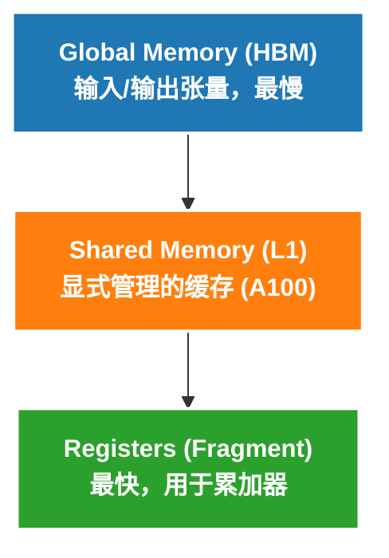
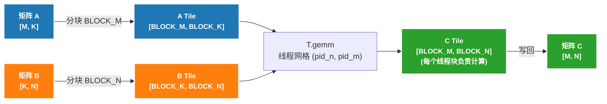

# Matrix Computation 实现指南

## 概述

本文档详细讲解矩阵运算实现，包括矩阵-向量乘法（GEMV）和矩阵-矩阵乘法（GEMM）。

## 核心概念

### 1. 混合精度计算

```python
dtype = T.float16        # 输入输出使用 float16
accum_dtype = T.float32  # 累加器使用 float32
```

**为什么这样设计？**
- float16 节省内存带宽，Tensor Core 原生支持
- float32 累加器避免数值溢出（float16 最大值约 65504），保证精度
- 这是深度学习推理的标准做法

> 本文档中的完整代码默认 `M % BLOCK_M == 0`、`N % BLOCK_N == 0`、`K % BLOCK_K == 0`。
> 先把注意力集中在分块、`T.gemm` 和 `T.Pipelined` 的数据流上，边界处理放到后文统一讨论。

### 2. 内存层次结构



### 3. Tensor Core vs CUDA Core

| 特性 | CUDA Core | Tensor Core |
|------|-----------|-------------|
| 运算类型 | 标量/向量 | 矩阵 |
| 指令 | FMA | MMA (Matrix Multiply Accumulate) |
| 吞吐量 | 中等 | 极高 (2-8x) |
| TileLang API | 手动循环 | `T.gemm()` |

---

## GEMV 实现详解

### 问题定义

GEMV（矩阵-向量乘法）计算 `C = A @ B`，其中：
- `A: [M, K]` - 输入矩阵
- `B: [K]` - 输入向量
- `C: [M]` - 输出向量

数学定义：
```
C[i] = Σ_k A[i, k] * B[k]
```

### 分块策略

**为什么需要分块？**

假设 M = 4096, K = 4096：
- 如果不分块，每个线程块需要处理全部 K=4096 个元素
- 寄存器不够存储这么多数据
- 因此需要在 K 维度分块，每次只处理 BLOCK_K 个元素

**分块后的计算**：
```
原始计算: C[i] = Σ_{k=0}^{K-1} A[i, k] * B[k]

分块计算: 
  C[i] = 0
  for k_block in range(K // BLOCK_K):
      C[i] += Σ_{k=0}^{BLOCK_K-1} A[i, k_block*BLOCK_K + k] * B[k_block*BLOCK_K + k]
```

### 代码详解

```python
@tilelang.jit
def tl_gemv(A, B, BLOCK_M: int, BLOCK_K: int):
    M, K = T.const("M, K")
    dtype = T.float16
    accum_dtype = T.float32
    A: T.Tensor((M, K), dtype)
    B: T.Tensor((K,), dtype)
    C = T.empty((M,), dtype)

    # 在 M 维度并行：启动 M // BLOCK_M 个线程块
    # 每个线程块处理 BLOCK_M 行的输出
    with T.Kernel(T.ceildiv(M, BLOCK_M), threads=128) as pid_m:
```

**第 1 步：分配寄存器**

```python
        A_local = T.alloc_fragment((BLOCK_M, BLOCK_K), dtype)
        B_local = T.alloc_fragment((BLOCK_K,), dtype)
        C_local = T.alloc_fragment((BLOCK_M,), accum_dtype)
        AB_temp = T.alloc_fragment((BLOCK_M, BLOCK_K), accum_dtype)
```

| 变量 | 形状 | 数据类型 | 说明 |
|------|------|----------|------|
| `A_local` | `[BLOCK_M, BLOCK_K]` | float16 | 存储 A 的一个 tile（BLOCK_M 行，BLOCK_K 列）|
| `B_local` | `[BLOCK_K]` | float16 | 存储 B 的一个片段（BLOCK_K 个元素）|
| `C_local` | `[BLOCK_M]` | **float32** | 累加器，存储部分和 |
| `AB_temp` | `[BLOCK_M, BLOCK_K]` | float32 | 临时存储乘法结果 |

**关键点**：`C_local` 和 `AB_temp` 用 float32 是为了保证累加精度。

**第 2 步：初始化累加器**

```python
        T.clear(C_local)
```

**必须清零！** 否则 `C_local` 会包含未定义的垃圾值。

**第 3 步：K 维度串行遍历**

```python
        for k in T.Serial(K // BLOCK_K):
            # 加载 A 的 tile
            T.copy(A[pid_m * BLOCK_M, k * BLOCK_K], A_local)
            # 加载 B 的 tile
            T.copy(B[k * BLOCK_K], B_local)
```

**第 4 步：逐元素乘法 + 归约**

```python
            for i, j in T.Parallel(BLOCK_M, BLOCK_K):
                AB_temp[i, j] = A_local[i, j].astype(accum_dtype) * B_local[j].astype(accum_dtype)

            T.reduce_sum(AB_temp, C_local, dim=1, clear=False)
```

- `T.Parallel` 让所有线程并行计算
- `astype(accum_dtype)` 显式转换为 float32 保证精度
- `reduce_sum(..., dim=1)` 沿着 K 维度求和
- `clear=False` 表示累加到现有值，而不是覆盖

**第 5 步：写回结果**

```python
        T.copy(C_local, C[pid_m * BLOCK_M])
```

### 维度对应关系

```
A: [M, K]  →  A_local: [BLOCK_M, BLOCK_K]
B: [K]     →  B_local: [BLOCK_K]
C: [M]     →  C_local: [BLOCK_M]

reduce_sum 沿 dim=1（K 维度）归约:
  AB_temp: [BLOCK_M, BLOCK_K] → C_local: [BLOCK_M]
```

---

## GEMM 朴素实现详解

### 问题定义

GEMM（矩阵-矩阵乘法）计算 `C = A @ B`，其中：
- `A: [M, K]` - 左矩阵
- `B: [K, N]` - 右矩阵
- `C: [M, N]` - 输出矩阵

数学定义：
```
C[i, j] = Σ_k A[i, k] * B[k, j]
```

### GEMV vs GEMM 对比

| 特性 | GEMV | GEMM |
|------|------|------|
| 输出维度 | `[M]` (向量) | `[M, N]` (矩阵) |
| 线程块数 | M // BLOCK_M | (M // BLOCK_M) × (N // BLOCK_N) |
| 计算复杂度 | O(M × K) | O(M × N × K) |
| 关键操作 | reduce_sum | T.gemm (Tensor Core) |

### 分块策略图示



### 代码详解

```python
@tilelang.jit
def tl_matmul_naive(A, B, BLOCK_M: int, BLOCK_N: int, BLOCK_K: int):
    M, N, K = T.const("M, N, K")
    dtype = T.float16
    accum_dtype = T.float32
    A: T.Tensor((M, K), dtype)
    B: T.Tensor((K, N), dtype)
    C = T.empty((M, N), dtype)

    # 二维网格：在 N 和 M 维度并行
    # 注意：Kernel 参数顺序是 (grid_x, grid_y)，对应 (pid_n, pid_m)
    with T.Kernel(T.ceildiv(N, BLOCK_N), T.ceildiv(M, BLOCK_M), threads=128) as (pid_n, pid_m):
```

**Kernel 参数顺序**：
- 第一个参数 `T.ceildiv(N, BLOCK_N)` 决定 grid 的 x 维度
- 第二个参数 `T.ceildiv(M, BLOCK_M)` 决定 grid 的 y 维度
- `pid_n` 对应 N 维度（B 的列）
- `pid_m` 对应 M 维度（A 的行）

**第 1 步：分配寄存器**

```python
        A_frag = T.alloc_fragment((BLOCK_M, BLOCK_K), dtype)
        B_frag = T.alloc_fragment((BLOCK_K, BLOCK_N), dtype)
        C_frag = T.alloc_fragment((BLOCK_M, BLOCK_N), accum_dtype)
```

**第 2 步：初始化累加器**

```python
        T.clear(C_frag)
```

**第 3 步：K 维度串行遍历 + Tensor Core 计算**

```python
        for k in T.Serial(K // BLOCK_K):
            # 加载 A 的 tile
            T.copy(A[pid_m * BLOCK_M, k * BLOCK_K], A_frag)
            # 加载 B 的 tile
            T.copy(B[k * BLOCK_K, pid_n * BLOCK_N], B_frag)
            # 使用 Tensor Core 计算
            T.gemm(A_frag, B_frag, C_frag)
```

**第 4 步：写回结果**

```python
        T.copy(C_frag, C[pid_m * BLOCK_M, pid_n * BLOCK_N])
```

**`T.gemm` 的作用**：
1. 自动利用 Tensor Core 生成高效的 MMA 指令
2. 结果累加到 `C_frag`，而非覆盖
3. 支持 Fragment、Shared Memory 作为输入

### 为什么朴素实现不够快？

**问题 1：寄存器压力**

```
朴素实现中，A_frag、B_frag、C_frag 都在寄存器中：
- A_frag: BLOCK_M × BLOCK_K × 2 bytes (float16)
- B_frag: BLOCK_K × BLOCK_N × 2 bytes (float16)
- C_frag: BLOCK_M × BLOCK_N × 4 bytes (float32)

当 BLOCK_M=128, BLOCK_N=128, BLOCK_K=64:
- 总寄存器使用 = 128×64×2 + 64×128×2 + 128×128×4
              = 16KB + 16KB + 64KB = 96KB

这里的字节数估算只是教学上的数量级直觉，不是精确的“每线程寄存器账本”。
真正的 lowering 会在 warp / MMA / 临时寄存器之间重新分配资源，但结论不变：
当 A、B、C 三类 tile 都尽量放在 Fragment 中时，寄存器压力会明显增大，进而影响 occupancy，并可能触发 spilling。

结果：寄存器溢出（spilling），性能大幅下降
```

**问题 2：内存延迟未隐藏**

```
朴素版本的执行顺序：
迭代 0: [加载 A0, B0] → [计算 C0]
迭代 1:               [加载 A1, B1] → [计算 C1]
迭代 2:                              [加载 A2, B2] → [计算 C2]

内存加载和计算是串行的，GPU 计算单元在等待内存时会空闲
```

---

## GEMM 优化实现详解

### 优化 1：使用共享内存

```python
@tilelang.jit
def tl_matmul_opt(A, B, BLOCK_M: int, BLOCK_N: int, BLOCK_K: int):
    # ...
    with T.Kernel(T.ceildiv(N, BLOCK_N), T.ceildiv(M, BLOCK_M), threads=128) as (pid_n, pid_m):
        # 朴素版本：全部用 Fragment（寄存器）
        # A_frag = T.alloc_fragment((BLOCK_M, BLOCK_K), dtype)
        # B_frag = T.alloc_fragment((BLOCK_K, BLOCK_N), dtype)

        # 优化版本：A 和 B 用共享内存
        A_shared = T.alloc_shared((BLOCK_M, BLOCK_K), dtype)
        B_shared = T.alloc_shared((BLOCK_K, BLOCK_N), dtype)
        # C 的累加器仍用 Fragment，因为需要频繁读写
        C_local = T.alloc_fragment((BLOCK_M, BLOCK_N), accum_dtype)
```

**为什么共享内存更适合优化版？**

| 特性 | Fragment（寄存器） | Shared Memory |
|------|-------------------|---------------|
| 容量 | 有限| 较大 |
| 访问速度 | 最快 | 比全局内存快  |
| 可见性 | 线程私有 | 线程块共享 |
| 适用场景 | 累加器、临时变量 | 输入数据的 tile |

这里要注意
- `T.gemm` 并不是“只能吃 Shared Memory”
- 朴素版本已经证明 Fragment 输入也是可以工作的
- 之所以优化版切到 Shared Memory，是为了更好地平衡寄存器占用、数据复用和流水线调度

**为什么 C 累加器仍用 Fragment？**

- C 需要在 K 维度迭代中频繁累加（每次 gemm 都要读写）
- Fragment（寄存器）访问最快
- A 和 B 只需要加载一次，然后用完即可，用共享内存足够

### 优化 2：软件流水线

```python
        # 朴素版本：串行执行
        # for k in T.Serial(K // BLOCK_K):
        #     T.copy(...)  # 加载
        #     T.gemm(...)  # 计算

        # 优化版本：流水线执行
        for k in T.Pipelined(K // BLOCK_K, num_stages=3):
            T.copy(A[pid_m * BLOCK_M, k * BLOCK_K], A_shared)
            T.copy(B[k * BLOCK_K, pid_n * BLOCK_N], B_shared)
            T.gemm(A_shared, B_shared, C_local)

        # 写回结果
        T.copy(C_local, C[pid_m * BLOCK_M, pid_n * BLOCK_N])
```

**流水线原理**：

```
3-stage 流水线的执行顺序：

时间 →
迭代 0: [加载 A0, B0]
迭代 1: [加载 A1, B1] [计算 C0]  ← 重叠！
迭代 2: [加载 A2, B2] [计算 C1]  ← 重叠！
迭代 3:                   [计算 C2]

效果：计算和内存访问并行执行，隐藏内存延迟
```

**`num_stages` 的选择**：

| num_stages | 效果 | 共享内存开销 |
|------------|------|-------------|
| 1 | 无流水线（串行） | 1x |
| 2 | 双缓冲，中等优化 | 2x |
| 3 | 三级流水线，推荐 | 3x |
| 4+ | 收益递减 | 4x+ |

**建议**：从 `num_stages=3` 开始，如果共享内存或 occupancy 压力太大再降低。

### 共享内存大小计算

```python
# 以 BLOCK_M=128, BLOCK_N=128, BLOCK_K=64, num_stages=3 为例：
A_shared_size = 128 × 64 × 2 bytes × 3 stages = 48 KB
B_shared_size = 64 × 128 × 2 bytes × 3 stages = 48 KB
C_frag_size = 128 × 128 × 4 bytes = 64 KB (寄存器)

共享内存总计 ≈ 96 KB，在 A100 的共享内存限制内
```

---

## 性能优化要点

### 1. 块大小选择

| GPU 架构 | 推荐块大小 | 说明 |
|----------|-----------|------|
| Ampere (A100) | 128×128×32 | 平衡寄存器和共享内存使用 |
| Hopper (H100) | 256×128×32 | 更大的共享内存，可以支持更大的块 |

### 2. 流水线深度

- `num_stages=1`: 无流水线（串行）
- `num_stages=2`: 2-stage 流水线（双缓冲）
- `num_stages=3`: 3-stage 流水线（推荐，适用于大多数情况）
- `num_stages=4+`: 收益递减，增加共享内存压力

### 3. 为什么共享内存 + 流水线更快？

```
朴素版本 (Fragment + Serial):
  迭代0: [加载A] [加载B] [计算] 
  迭代1:          [加载A] [加载B] [计算]
  迭代2:                   [加载A] [加载B] [计算]

优化版本 (Shared Memory + Pipeline):
  迭代0: [加载A0] [加载B0]
  迭代1: [加载A1] [加载B1] [计算C0]
  迭代2: [加载A2] [加载B2] [计算C1]
  迭代3:                   [计算C2]
```

流水线让计算和内存访问重叠，隐藏内存延迟。

---

## 数值精度问题

### float16 精度限制

在测试大矩阵乘法时（如 M=N=K=4096），可能会发现结果不完全匹配：

```
❌ Results match: False
Max diff: tensor(0.25)
Mean diff: tensor(0.0095)
```

**这是正常现象**，原因：

| 因素 | 影响 |
|------|------|
| K=4096 累加 | 4096 次乘加操作，误差累积 |
| float16 精度 | 仅 3-4 位有效数字，最大值约 65504 |
| Tensor Core 舍入 | 不同的舍入方式可能产生微小差异 |

## 边界检查（可选）

上述代码假设矩阵维度 M、N、K 能被对应的 BLOCK 大小整除。在**生产环境**中，需要添加边界检查以处理任意大小：

```python
# 加载时检查边界
A_shared[i, j] = T.if_then_else(
    by * BLOCK_M + i < M and k * BLOCK_K + j < K,
    A[by * BLOCK_M + i, k * BLOCK_K + j],
    0,  # 越界填充 0，不影响累加结果
)
```

边界检查会带来轻微性能开销，但换来：
- 支持任意矩阵大小
- 避免 GPU 程序崩溃或产生错误结果

**演示场景**下可省略，使用整除的矩阵大小即可。本文前面的完整代码默认三个维度都能被对应 block 整除；如果只把 grid 改成 `T.ceildiv`，但不对加载和写回加 mask，最后一个 block 仍然可能越界。

---

## 扩展阅读

1. [CUDA C Programming Guide - Shared Memory](https://docs.nvidia.com/cuda/cuda-c-programming-guide/index.html#shared-memory)
2. [NVIDIA Tensor Core](https://developer.nvidia.com/tensor-cores)
3. [FlashAttention: Fast and Memory-Efficient Exact Attention](https://arxiv.org/abs/2205.14135)
