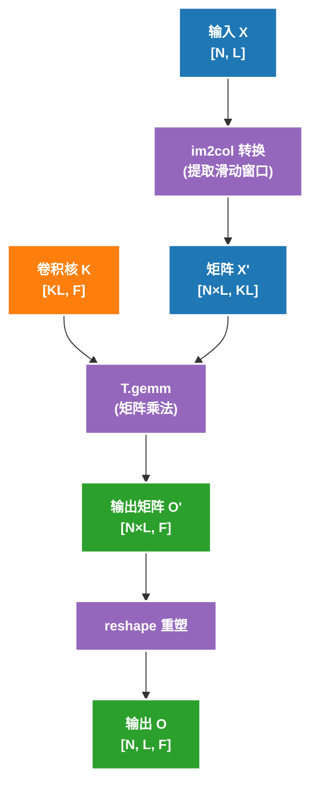

# Puzzle 09: Convolution 代码解析

## 概述

这个 puzzle 介绍了深度学习中另一个核心计算模式：**卷积运算（Convolution）**。卷积在计算机视觉和深度学习中广泛应用，是 CNN（卷积神经网络）的核心算子。

## 为什么卷积运算如此重要？

在深度学习中，卷积运算无处不在：
- **图像识别**: CNN 中的卷积层提取图像特征
- **自然语言处理**: 1D 卷积用于文本序列处理
- **语音识别**: 时序信号的卷积处理
- **视频分析**: 3D 卷积处理时空特征

卷积的特点是：
- **局部连接**: 每个输出只依赖于输入的局部区域
- **参数共享**: 同一个卷积核在所有位置共享参数
- **强数据重用**: 相邻输出共享大部分输入数据

> 注意：这里的 1D 卷积沿用了深度学习里 `torch.conv1d` 的常见约定，计算顺序上更接近 cross-correlation（互相关），而不是把卷积核翻转后的数学卷积。这里仍然使用“卷积”这一术语，是因为它是 DL 领域的标准叫法。

---

## Part 1: 1D 卷积

### 问题定义

**输入**:
- `X: [N, L]` - 输入张量 (float16)
- `K: [KL]` - 卷积核 (float16)
- `N: int` - batch size, 1 ≤ N ≤ 64
- `L: int` - 序列长度, 1 ≤ L ≤ 1024
- `KL: int` - 卷积核长度, 1 ≤ KL ≤ 32

**输出**:
- `O: [N, L]` - 输出张量 (float16)

**中间变量**:
- `ACC: float32` - 累加器

**计算定义**:
```python
for i in range(N):
    for j in range(L):
        ACC = 0
        for k in range(KL):
            if j + k < L:  # 边界检查
                ACC += X[i, j + k] * K[k]
        O[i, j] = ACC
```

### 直观理解

假设 `X` 是长度为 5 的序列，`K` 是长度为 3 的卷积核：

```
X = [1, 2, 3, 4, 5]
K = [a, b, c]

滑动窗口计算：
j=0: O[0] = X[0]*a + X[1]*b + X[2]*c = 1*a + 2*b + 3*c
j=1: O[1] = X[1]*a + X[2]*b + X[3]*c = 2*a + 3*b + 4*c
j=2: O[2] = X[2]*a + X[3]*b + X[4]*c = 3*a + 4*b + 5*c
j=3: O[3] = X[3]*a + X[4]*b + X[5]*c = 4*a + 5*b + 0*c (边界)
j=4: O[4] = X[4]*a + X[5]*b + X[6]*c = 5*a + 0*b + 0*c (边界)
```

### 数据重用模式

卷积的突出特点之一是数据重用：

```
输入序列: X = [x0, x1, x2, x3, x4, x5, ...]
卷积核:   K = [k0, k1, k2]

计算 O[0] 需要: X[0], X[1], X[2]
计算 O[1] 需要: X[1], X[2], X[3]  ← X[1], X[2] 被重用
计算 O[2] 需要: X[2], X[3], X[4]  ← X[2], X[3] 被重用
...
```

每个输入元素会被多个输出位置使用，这为优化提供了机会。

### PyTorch 参考实现

```python
def ref_conv1d(X: torch.Tensor, K: torch.Tensor):
    assert len(X.shape) == 2
    assert len(K.shape) == 1
    assert X.dtype == K.dtype == torch.float16

    N, L = X.shape
    KL = K.shape[0]

    # 添加 padding 以保持输出长度
    padding_size = KL - 1
    X_padded = torch.nn.functional.pad(X.view(N, 1, L), (0, padding_size))

    return torch.conv1d(
        input=X_padded,
        weight=K.view(1, 1, KL),
    ).view(N, L)
```

### 实现框架

```python
@tilelang.jit(
    pass_configs={
        tilelang.PassConfigKey.TL_DISABLE_WARP_SPECIALIZED: True,
        tilelang.PassConfigKey.TL_DISABLE_TMA_LOWER: True,
    },
)
def tl_conv1d_naive(X, K, BLOCK_N: int, BLOCK_L: int):
    N, L, KL = T.const("N, L, KL")
    dtype = T.float16
    accum_dtype = T.float32
    X: T.Tensor((N, L), dtype)
    K: T.Tensor((KL,), dtype)
    O = T.empty((N, L), dtype)

    # TODO: 实现这个函数
    # 提示:
    # 1. 使用 T.ceildiv 处理非整除情况
    # 2. 在 N 和 L 维度分块
    # 3. 注意边界检查（加载、计算、写回三处都需要）

    return O
```

---

## Part 2: 多输出通道的 1D 卷积

### 问题定义

为了更好地利用 Tensor Core 和 `T.gemm`，我们引入输出通道维度 F。

**输入**:
- `X: [N, L]` - 输入张量 (float16)
- `K: [KL, F]` - 卷积核 (float16)
- `N: int` - batch size
- `L: int` - 序列长度
- `KL: int` - 卷积核长度
- `F: int` - 输出通道数, 32 ≤ F ≤ 128

**输出**:
- `O: [N, L, F]` - 输出张量 (float16)

**中间变量**:
- `ACC: float32` - 累加器

**计算定义**:
```python
for i in range(N):
    for j in range(L):
        for f in range(F):
            ACC = 0
            for k in range(KL):
                if j + k < L:
                    ACC += X[i, j + k] * K[k, f]
            O[i, j, f] = ACC
```

### 与矩阵乘法的关系（im2col）

卷积可以转换为矩阵乘法，这就是著名的 **im2col (image to column)** 技术：



**im2col 示例**:

```
输入 X = [1, 2, 3, 4, 5] (L=5)
卷积核长度 KL = 3

im2col 后的矩阵 X':
[[1, 2, 3],   # 对应 O[0]
 [2, 3, 4],   # 对应 O[1]
 [3, 4, 5],   # 对应 O[2]
 [4, 5, 0],   # 对应 O[3] (边界填充)
 [5, 0, 0]]   # 对应 O[4] (边界填充)
```

这样，卷积就变成了矩阵乘法 `X' @ K`，可以利用 Tensor Core 高效计算。

### PyTorch 参考实现

```python
def ref_conv1d_multi_outchannel(X: torch.Tensor, K: torch.Tensor):
    assert len(X.shape) == 2
    assert len(K.shape) == 2
    assert X.dtype == K.dtype == torch.float16

    N, L = X.shape
    KL, F = K.shape

    padding_size = KL - 1
    X_padded = torch.nn.functional.pad(X.view(N, 1, L), (0, padding_size))

    return (
        torch.conv1d(
            input=X_padded,
            weight=K.permute(1, 0).view(F, 1, KL),
        )
        .permute(0, 2, 1)
        .contiguous()
    )
```

### 实现框架（朴素版本）

```python
@tilelang.jit(
    pass_configs={
        tilelang.PassConfigKey.TL_DISABLE_WARP_SPECIALIZED: True,
        tilelang.PassConfigKey.TL_DISABLE_TMA_LOWER: True,
    },
)
def tl_conv1d_multi_outchannel(X, K, BLOCK_N: int, BLOCK_L: int):
    N, L, KL, F = T.const("N, L, KL, F")
    dtype = T.float16
    accum_dtype = T.float32
    X: T.Tensor((N, L), dtype)
    K: T.Tensor((KL, F), dtype)
    O = T.empty((N, L, F), dtype)

    # TODO: 实现这个函数
    # 提示:
    # 1. 使用 T.ceildiv 处理非整除情况
    # 2. 在 N, L, F 维度分块
    # 3. 处理边界条件（加载、计算、写回）

    return O
```

### 实现框架（im2col + GEMM）

```python
@tilelang.jit(
    pass_configs={
        tilelang.PassConfigKey.TL_DISABLE_WARP_SPECIALIZED: True,
        tilelang.PassConfigKey.TL_DISABLE_TMA_LOWER: True,
    },
)
def tl_conv1d_im2col(X, K, BLOCK_N: int, BLOCK_L: int):
    N, L, KL, F = T.const("N, L, KL, F")
    dtype = T.float16
    accum_dtype = T.float32
    X: T.Tensor((N, L), dtype)
    K: T.Tensor((KL, F), dtype)
    O = T.empty((N, L, F), dtype)

    # TODO: 实现 im2col + GEMM 优化版本
    # 提示:
    # 1. 使用 T.ceildiv 处理非整除情况
    # 2. 使用共享内存存储 im2col 后的 X tile
    # 3. 使用 T.gemm 进行矩阵乘法
    # 4. 注意边界检查

    return O
```

---

## 核心概念

### 1. 共享内存（Shared Memory）在卷积中的应用

卷积的数据重用特性非常适合使用共享内存：

```python
# 加载输入 tile 到共享内存（包含 halo 区域）
X_shared = T.alloc_shared((BLOCK_N, BLOCK_L + KL - 1), dtype)

# 多个输出位置可以重用 X_shared 中的数据
# 不需要反复从全局内存读取
```

**优势**:
- 减少 HBM（全局内存）访问
- 利用数据重用特性
- 提高内存带宽利用率

### 2. im2col 在 GPU 上的实现

在 GPU 上，我们可以：
- **动态 im2col**: 在 kernel 内部即时构建 im2col 矩阵
- **隐式 im2col**: 不显式存储 im2col 矩阵，而是在访问时动态计算索引

```python
# 隐式 im2col
for k in range(KL):
    x_idx = j + k  # 动态计算索引
    if x_idx < L:
        ACC += X[i, x_idx] * K[k]
```

### 3. 边界处理

#### 为什么边界处理很重要？

在真实场景中，输入维度往往**不是 block size 的倍数**：

```python
# 真实场景示例
image_sizes = [224, 384, 512, 640, 768]  # 图像尺寸不整除
prompt_lengths = [23, 87, 156, 342]       # NLP 序列长度不整除
batch_sizes = [1, 3, 7, 12, 31]           # 批量大小不整除
```

#### 使用 ceildiv + 边界检查

```python
with T.Kernel(N // BLOCK_N, L // BLOCK_L, threads=256) as (pid_n, pid_l):
    X_shared = T.alloc_shared((BLOCK_N, BLOCK_L, KL), dtype)
    K_shared = T.alloc_shared((KL, F), dtype)
    O_local = T.alloc_fragment((BLOCK_N * BLOCK_L, F), accum_dtype)

    for i, j, k in T.Parallel(BLOCK_N, BLOCK_L, KL):
        X_shared[i, j, k] = T.if_then_else(
            pid_l * BLOCK_L + j + k < L, X[pid_n * BLOCK_N + i, pid_l * BLOCK_L + j + k], 0
        )
    X_reshaped = T.reshape(X_shared, (BLOCK_N * BLOCK_L, KL))
    T.copy(K, K_shared)
    T.gemm(X_reshaped, K_shared, O_local, clear_accum=True)
    O_reshaped = T.reshape(O_local, (BLOCK_N, BLOCK_L, F))
    T.copy(O_reshaped, O[pid_n * BLOCK_N, pid_l * BLOCK_L, 0])
```

#### 边界处理三步骤

| 步骤 | 位置 | 检查内容 |
|------|------|---------|
| 加载 | 从全局内存读取 | 索引是否越界，越界填 0 |
| 计算 | 卷积计算 | 输出位置 + kernel 偏移是否越界 |
| 写回 | 写入全局内存 | 输出位置是否在有效范围内 |

---

## 与矩阵乘法的对比

| 特性 | GEMM (Puzzle 08) | Conv1D (Puzzle 09) |
|------|------------------|-------------------|
| 输入维度 | A[M, K], B[K, N] | X[N, L], K[KL, F] |
| 输出维度 | C[M, N] | O[N, L, F] |
| 核心操作 | T.gemm | T.gemm (im2col 后) |
| 数据重用 | 规则 | 滑动窗口 |
| 边界处理 | 不需要 | **必须处理** |
| 优化技术 | Shared Memory + Pipeline | im2col + GEMM |

---

## 性能优化要点

### 1. im2col vs 朴素实现

```
朴素实现:
- 灵活，适用于任意卷积配置
- 数据访问不规则，缓存利用率低

im2col + GEMM:
- 规则的矩阵乘法，缓存利用率高
- 可以利用 Tensor Core
- 需要额外的 im2col 转换开销
```

### 2. 共享内存的使用

```python
# 加载输入时，考虑 halo 区域（卷积核范围）
# 一次性加载 BLOCK_L + KL - 1 个元素
X_shared = T.alloc_shared((BLOCK_N, BLOCK_L + KL - 1), dtype)
```

### 3. 软件流水线

```python
for k in T.Pipelined(KL, num_stages=2):
    # 重叠数据加载和计算
    T.copy(X[...], X_shared)
    T.gemm(X_shared, K_frag, O_frag)
```

---
## 扩展阅读

1. **卷积优化**: Winograd 算法、FFT 卷积、直接卷积
2. **im2col**: cuDNN 的卷积实现方式
3. **深度学习框架**: PyTorch/TensorFlow 如何实现卷积
4. **Tensor Core**: NVIDIA 的矩阵运算加速单元
5. **Winograd 算法**: 减少卷积计算量的算法
