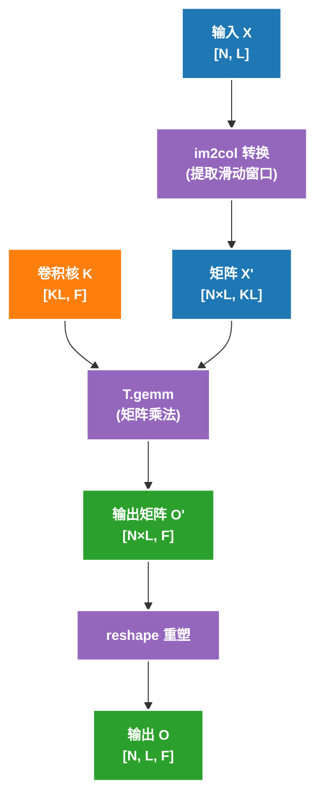

# Convolution 实现指南

## 概述

本文档详细说明如何实现高效的 1D 卷积算子，包括朴素实现和基于 im2col 的优化实现。

## 核心约束

卷积的关键特点是**数据依赖**和**边界处理**：

- **数据依赖**: 每个输出位置依赖输入的滑动窗口
- **边界处理**: 需要处理序列末尾的边界条件（**必须使用 ceildiv**）
- **数据重用**: 相邻输出共享大部分输入数据

---

## Part 1: Conv1D 朴素实现

### 实现思路

1. **并行策略**: 在 N 和 L 维度分块，每个 block 处理一个输出 tile
2. **串行计算**: 在 KL 维度串行遍历，累加结果
3. **边界处理**: 使用 `T.ceildiv` + `T.if_then_else` 处理边界

### 完整实现

```python
@tilelang.jit(
    pass_configs={
        tilelang.PassConfigKey.TL_DISABLE_WARP_SPECIALIZED: True,
        tilelang.PassConfigKey.TL_DISABLE_TMA_LOWER: True,
    },
)
def tl_conv1d_naive(X, K, BLOCK_N: int, BLOCK_L: int):
    N, L, KL = T.const("N, L, KL")
    dtype = T.float16
    accum_dtype = T.float32
    X: T.Tensor((N, L), dtype)
    K: T.Tensor((KL,), dtype)
    O = T.empty((N, L), dtype)

    # 使用 T.ceildiv 处理非整除情况
    with T.Kernel(T.ceildiv(N, BLOCK_N), T.ceildiv(L, BLOCK_L), threads=256) as (pid_n, pid_l):
        X_shared = T.alloc_shared((BLOCK_N, BLOCK_L + KL - 1), dtype)
        K_local = T.alloc_fragment((KL), dtype)
        O_local = T.alloc_shared((BLOCK_N,), accum_dtype)

        temp = T.alloc_fragment((BLOCK_N, KL), accum_dtype)  # temporary buffer for reduce

        # 加载数据时检查边界，避免越界读取
        for i, j in T.Parallel(BLOCK_N, BLOCK_L + KL - 1):
            X_shared[i, j] = T.if_then_else(
                pid_n * BLOCK_N + i < N and pid_l * BLOCK_L + j < L,
                X[pid_n * BLOCK_N + i, pid_l * BLOCK_L + j],
                0,
            )
        T.copy(K, K_local)

        for l in T.Serial(BLOCK_L):
            for i, kl in T.Parallel(BLOCK_N, KL):
                # 边界检查：确保不越界
                temp[i, kl] = T.if_then_else(
                    pid_l * BLOCK_L + l + kl < L,
                    X_shared[i, l + kl].astype(accum_dtype) * K_local[kl].astype(accum_dtype),
                    0,
                )
            T.reduce_sum(temp, O_local, dim=-1, clear=True)
            # 写回时检查边界
            for i in T.Parallel(BLOCK_N):
                if pid_n * BLOCK_N + i < N and pid_l * BLOCK_L + l < L:
                    O[pid_n * BLOCK_N + i, pid_l * BLOCK_L + l] = O_local[i].astype(dtype)

    return O
```

### 关键代码解析

#### 1. 使用 ceildiv

```python
# 使用 ceildiv
with T.Kernel(T.ceildiv(N, BLOCK_N), T.ceildiv(L, BLOCK_L), ...) as (pid_n, pid_l):
```

**原因**：当 N=130, BLOCK_N=16 时：
- `N // BLOCK_N = 8`，只启动 8 个 block，处理 128 个元素，**丢失最后 2 个**
- `T.ceildiv(N, BLOCK_N) = 9`，启动 9 个 block，正确处理全部 130 个元素

#### 2. 加载时的边界检查

```python
for i, j in T.Parallel(BLOCK_N, BLOCK_L + KL - 1):
    X_shared[i, j] = T.if_then_else(
        pid_n * BLOCK_N + i < N and pid_l * BLOCK_L + j < L,
        X[pid_n * BLOCK_N + i, pid_l * BLOCK_L + j],
        0,  # 越界位置填充 0
    )
```

#### 3. 计算时的边界检查

```python
temp[i, kl] = T.if_then_else(
    pid_l * BLOCK_L + l + kl < L,
    X_shared[i, l + kl].astype(accum_dtype) * K_local[kl].astype(accum_dtype),
    0,  # 卷积核超出边界时填充 0
)
```

#### 4. 写回时的边界检查

```python
for i in T.Parallel(BLOCK_N):
    if pid_n * BLOCK_N + i < N and pid_l * BLOCK_L + l < L:
        O[pid_n * BLOCK_N + i, pid_l * BLOCK_L + l] = O_local[i].astype(dtype)
```

---

## Part 2: Conv1D 多输出通道

### 实现思路

扩展朴素实现，添加输出通道维度 F。由于题目给定 F ∈ [32, 128]，可以直接处理所有 F，无需分块。

### 完整实现

```python
@tilelang.jit(
    pass_configs={
        tilelang.PassConfigKey.TL_DISABLE_WARP_SPECIALIZED: True,
        tilelang.PassConfigKey.TL_DISABLE_TMA_LOWER: True,
    },
)
def tl_conv1d_multi_outchannel(X, K, BLOCK_N: int, BLOCK_L: int):
    N, L, KL, F = T.const("N, L, KL, F")
    dtype = T.float16
    accum_dtype = T.float32
    X: T.Tensor((N, L), dtype)
    K: T.Tensor((KL, F), dtype)
    O = T.empty((N, L, F), dtype)

    # 使用 T.ceildiv 处理非整除情况
    with T.Kernel(T.ceildiv(N, BLOCK_N), T.ceildiv(L, BLOCK_L), threads=256) as (pid_n, pid_l):
        X_shared = T.alloc_shared((BLOCK_N, BLOCK_L + KL - 1), dtype)
        K_local = T.alloc_fragment((KL, F), dtype)
        O_local = T.alloc_shared((BLOCK_N, F), accum_dtype)

        temp = T.alloc_fragment((BLOCK_N, KL, F), accum_dtype)  # temporary buffer for reduce

        # 加载数据时检查边界，避免越界读取
        for i, j in T.Parallel(BLOCK_N, BLOCK_L + KL - 1):
            X_shared[i, j] = T.if_then_else(
                pid_n * BLOCK_N + i < N and pid_l * BLOCK_L + j < L,
                X[pid_n * BLOCK_N + i, pid_l * BLOCK_L + j],
                0,
            )
        T.copy(K, K_local)

        for l in T.Serial(BLOCK_L):
            for i, f, kl in T.Parallel(BLOCK_N, F, KL):
                # 边界检查：确保不越界
                temp[i, kl, f] = T.if_then_else(
                    pid_l * BLOCK_L + l + kl < L,
                    X_shared[i, l + kl].astype(accum_dtype) * K_local[kl, f].astype(accum_dtype),
                    0,
                )
            T.reduce_sum(temp, O_local, dim=1, clear=True)
            # 写回时检查边界
            for i, f in T.Parallel(BLOCK_N, F):
                if pid_n * BLOCK_N + i < N and pid_l * BLOCK_L + l < L:
                    O[pid_n * BLOCK_N + i, pid_l * BLOCK_L + l, f] = O_local[i, f].astype(dtype)

    return O
```

### 与单通道版本的差异

| 方面 | 单通道版本 | 多通道版本 |
|------|-----------|-----------|
| K 形状 | `[KL]` | `[KL, F]` |
| O 形状 | `[N, L]` | `[N, L, F]` |
| temp 形状 | `[BLOCK_N, KL]` | `[BLOCK_N, KL, F]` |
| reduce 维度 | `dim=-1` | `dim=1` |

---

## Part 3: Conv1D im2col 优化实现

### 核心思想

使用 im2col 将卷积转换为矩阵乘法：



### 完整实现

```python
@tilelang.jit(
    pass_configs={
        tilelang.PassConfigKey.TL_DISABLE_WARP_SPECIALIZED: True,
        tilelang.PassConfigKey.TL_DISABLE_TMA_LOWER: True,
    },
)
def tl_conv1d_im2col(X, K, BLOCK_N: int, BLOCK_L: int):
    N, L, KL, F = T.const("N, L, KL, F")
    dtype = T.float16
    accum_dtype = T.float32
    X: T.Tensor((N, L), dtype)
    K: T.Tensor((KL, F), dtype)
    O = T.empty((N, L, F), dtype)

    # 使用 T.ceildiv 处理非整除情况
    with T.Kernel(T.ceildiv(N, BLOCK_N), T.ceildiv(L, BLOCK_L), threads=256) as (pid_n, pid_l):
        X_shared = T.alloc_shared((BLOCK_N, BLOCK_L, KL), dtype)
        K_shared = T.alloc_shared((KL, F), dtype)
        O_local = T.alloc_fragment((BLOCK_N * BLOCK_L, F), accum_dtype)

        # 加载数据时检查边界
        for i, j, k in T.Parallel(BLOCK_N, BLOCK_L, KL):
            X_shared[i, j, k] = T.if_then_else(
                pid_n * BLOCK_N + i < N and pid_l * BLOCK_L + j + k < L,
                X[pid_n * BLOCK_N + i, pid_l * BLOCK_L + j + k],
                0,
            )
        X_reshaped = T.reshape(X_shared, (BLOCK_N * BLOCK_L, KL))
        T.copy(K, K_shared)
        T.gemm(X_reshaped, K_shared, O_local, clear_accum=True)
        O_reshaped = T.reshape(O_local, (BLOCK_N, BLOCK_L, F))
        # 写回时检查边界
        for i, j, f in T.Parallel(BLOCK_N, BLOCK_L, F):
            if pid_n * BLOCK_N + i < N and pid_l * BLOCK_L + j < L:
                O[pid_n * BLOCK_N + i, pid_l * BLOCK_L + j, f] = O_reshaped[i, j, f].astype(dtype)

    return O
```

### 关键技术详解

#### 1. im2col 索引计算

```python
# im2col 本质：X'[n, l, k] = X[n, l + k]
for i, j, k in T.Parallel(BLOCK_N, BLOCK_L, KL):
    X_shared[i, j, k] = T.if_then_else(
        pid_n * BLOCK_N + i < N and pid_l * BLOCK_L + j + k < L,
        X[pid_n * BLOCK_N + i, pid_l * BLOCK_L + j + k],
        0,  # 边界填充
    )
```

#### 2. T.reshape 张量重塑

```python
# im2col 矩阵：[BLOCK_N, BLOCK_L, KL] -> [BLOCK_N * BLOCK_L, KL]
X_reshaped = T.reshape(X_shared, (BLOCK_N * BLOCK_L, KL))

# 输出矩阵：[BLOCK_N * BLOCK_L, F] -> [BLOCK_N, BLOCK_L, F]
O_reshaped = T.reshape(O_local, (BLOCK_N, BLOCK_L, F))
```

#### 3. T.gemm 的使用

```python
T.gemm(X_reshaped, K_shared, O_local, clear_accum=True)
```

- `clear_accum=True`：在计算前自动清零累加器
- 可利用 Tensor Core 加速

### im2col + GEMM 的优势

1. **利用 Tensor Core**: `T.gemm` 可以使用 Tensor Core 加速
2. **规则的内存访问**: 矩阵乘法的内存访问模式更规则
3. **成熟的优化技术**: 可以复用 GEMM 的所有优化

---

## 性能对比

### 朴素实现 vs im2col

| 方法 | 优点 | 缺点 | 适用场景 |
|------|------|------|---------|
| 朴素实现 | 逻辑简单，内存开销小 | 无法使用 Tensor Core | KL 较小，F 较小 |
| im2col + GEMM | 可用 Tensor Core，性能高 | 需要构建临时矩阵 | KL 和 F 较大 |

---

## 扩展到 2D 卷积

虽然这个 puzzle 只涉及 1D 卷积，但原理可以扩展到 2D：

```python
# 2D 卷积定义
for i in range(N):
    for h in range(H):
        for w in range(W):
            for f in range(F):
                ACC = 0
                for kh in range(KH):
                    for kw in range(KW):
                        if h + kh < H and w + kw < W:
                            ACC += X[i, h + kh, w + kw] * K[kh, kw, f]
                O[i, h, w, f] = ACC

# im2col 转换
# X: [N, H, W] → X_col: [N×H×W, KH×KW]
# K: [KH, KW, F] → K_mat: [KH×KW, F]
# O: [N, H, W, F] ← O_mat: [N×H×W, F]
```

---

## 扩展阅读

1. **cuDNN 卷积实现**: NVIDIA 的深度学习库如何优化卷积
2. **Winograd 算法**: 减少卷积计算量
3. **直接卷积**: 不使用 im2col 的优化方法
4. **FFT 卷积**: 使用快速傅里叶变换加速大卷积核
5. **深度可分离卷积**: MobileNet 中的高效卷积
